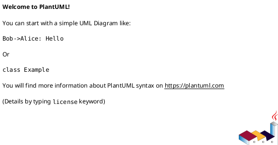

# 组件实现设计说明书

使用说明：

- 本模板用于 `devflow-component-design` 产出 `features/<id>/component-design-draft.md`，并在 review / sign-off 后由 `devflow-finalize` promote 到 `docs/component-design.md`。
- 正式交付件必须删除模板说明、示例业务内容和任何占位符；不得残留 `AI提示`、`TBD`、`{DATE}` 等模板痕迹。
- 本文档完整继承旧 `component-design-doc-template.md` 的作业结构：修订记录、术语、概述、输入、组件详细设计、关键功能设计、评审纪要、成本评估均为必填骨架。
- 本文档是 AR 实现设计的组件基线，下游 AR 必须引用功能编号、接口契约、软件单元、功能场景时序图和测试项。

## 1. 修订记录

| 日期 | 修订版本 | 修改章节 | 修改描述 | 作者 |
|---|---|---|---|---|
|  |  |  |  |  |

## 2. 术语

| 缩略语 | 英文全名 | 中文解释 |
|---|---|---|
| 软件组件 | Software Component | 软件系统架构设计的最低层架构元素，开展详细设计的对象 |
| 软件单元 | Software Unit | 组件内最小单独可执行和可测试的实体 |
| 软件功能 | Software Function | 对单个或一组相似功能的抽象 |

## 3. 概述

### 3.1 目的

详细设计软件组件的实现算法 / 流程、局部数据结构，细化到软件单元定义。同时定义软件单元间的动态行为（软件单元间的交互）。从互操作性、交互性、关键性、技术复杂性、风险和可测试性等方面对软件组件进行评估。详细设计的最终目标是能够直接指导后续模块设计及编码活动。

### 3.2 简介

| 字段 | 内容 |
|---|---|
| 组件名称 |  |
| 所属软件系统 / 子系统名称 | 一般对应 SE 软件架构设计中的子系统 |
| 组件职责 |  |
| 组件非职责 |  |
| ASIL 等级 | QM / ASILA / ASILB / ASILC / ASILD，来自软件架构设计定义 |
| 模块架构师 / Owner |  |

### 3.3 参考资料

| No. | Type | Associated Materials |
|---|---|---|
| 1 | 规范文档 |  |
| 2 | 产品文档 |  |

## 4. 输入

### 4.1 组件上下文视图

使用 PlantUML 组件图描述待开发软件组件与外围实体（底层软件、周边组件、硬件、外部服务）的关系。



### 4.2 组件全量功能列表

输出该功能组件的全量功能点列表，功能编号命名按需定义。功能编号应作为后续 AR 实现设计的基线引用。

| 功能编号 | 功能描述 | 纳入版本 |
|---|---|---|
| FUNC.001 |  |  |
| FUNC.002 |  |  |
| FUNC.003 |  |  |

| 功能编号 | 对应需求 / SR Row | 备注 |
|---|---|---|
|  |  |  |

## 5. 组件详细设计

### 5.1 软件 1 层实现设计

#### 5.1.1 开发视图

##### 5.1.1.1 代码结构模型

建议使用 PlantUML 部署图完成代码结构模型展示，体现 CMake / source 目录组织、分层和依赖方向。


##### 5.1.1.2 领域模型（可选）

如有领域模型，在此描述核心领域对象、关系和约束；不涉及时写明理由。

##### 5.1.1.3 实现模型

通过 PlantUML 类图展示实现细节，指导开发人员进行后续代码开发。类图应包含核心类、成员变量、方法、类间关系（聚合、组合、依赖、继承）和每个类的职责说明。


**说明**：

- 

##### 5.1.1.4 数据设计

描述组件中定义和使用的数据及数据结构，包括：简单数据，如组件级的全局变量、常量、宏；复合数据，如组件内部的结构、联合。

###### 5.1.1.4.1 简单数据描述

| 名称 | 类型 | 描述 | 取值范围 / 单位 | 生命周期 |
|---|---|---|---|---|
|  |  |  |  |  |

###### 5.1.1.4.2 复合数据描述

| 名称 | 类型 | 成员 | 描述 | 约束 |
|---|---|---|---|---|
|  |  |  |  |  |

##### 5.1.1.5 构建依赖

描述 SWC 和周边组件及开源组件的构建依赖关系。

| 组件名称 | 依赖库 | 依赖库归属 | 版本 / 编译条件 | 备注 |
|---|---|---|---|---|
|  |  |  |  |  |

#### 5.1.2 运行视图

##### 5.1.2.1 交互机制

粗粒度展示模块内各子组件或软件单元间的交互关系。详细功能交互在第 6 章体现。


##### 5.1.2.2 通信机制（可选）

描述组件内子组件之间的通讯机制；不涉及时写明理由。

##### 5.1.2.3 数据流机制（可选）

描述关键数据传递、转换、缓存和生命周期。

##### 5.1.2.4 并发机制

明确组件并发场景约束、多任务 / 定时器 / 线程 / 协程模型，并说明 spinlock / 原子操作 / mutex / 序列化消息等保护机制及开销。

### 5.2 数据库（可选）

如有数据库设计，在此章节描述。

| 实体名 | 属性 | 描述 | 数据量级 | 持久化 / 回滚策略 |
|---|---|---|---|---|
|  |  |  |  |  |

#### 5.2.1 实体、属性及它们之间的关系

| 实体名 | 属性 | 描述 |
|---|---|---|
|  |  |  |

#### 5.2.2 实体关系图

使用 ER 图描述实体间关系；不涉及时写明“不涉及”及理由。

### 5.3 UI 设计（可选，前台服务涉及）

描述关键用户交互设计、界面原型、操作流和异常提示；不涉及时写明理由。

## 6. 组件或子组件关键功能设计

### 6.1 接口定义

每个接口必须声明是否支持并发调用；不支持并发的接口需明确调用约束，支持并发的接口需说明保护机制。

#### 6.1.1 对外 Service 接口

| 接口名 | 描述 | 方法 | 参数 | 返回值 / 错误码 | 是否支持并发 | 并发约束 / 保护机制 | 兼容性策略 |
|---|---|---|---|---|---|---|---|
|  |  |  |  |  | 是 / 否 |  |  |

#### 6.1.2 对外 Topic 接口（可选）

| Topic 名 | 描述 | 载荷 | 是否支持并发 | 并发约束 / 保护机制 |
|---|---|---|---|---|
|  |  |  | 是 / 否 |  |

#### 6.1.3 对外 API 接口

| API 名 | 描述 | 参数 | 返回值 / 错误码 | 是否支持并发 | 并发约束 / 保护机制 |
|---|---|---|---|---|---|
|  |  |  |  | 是 / 否 |  |

#### 6.1.4 软件单元间内部接口

| 源软件单元 | 目标软件单元 | 接口名 | 描述 | 是否支持并发 | 并发约束 / 保护机制 |
|---|---|---|---|---|---|
|  |  |  |  | 是 / 否 |  |

### 6.2 功能列表详设

#### 6.2.1 FUNC.XXX 功能设计

##### 6.2.1.1 功能描述

- 功能简称:
- 功能描述:

| 场景分类 | 英文描述 | 场景描述 | 对应 AR / SR |
|---|---|---|---|
|  |  |  |  |

##### 6.2.1.2 处理流程描述

描述到软件单元间的流程处理。每个功能点的每个关键场景必须有 PlantUML 时序图。时序图必须细化到软件单元 / 类 / 方法调用级别，参与者用具体类名或软件单元名，消息体现方法调用和关键参数。

###### 6.2.1.2.1 xx 场景流程描述

使用时序图描述详细流程。时序图必须细化到软件单元 / 类的方法调用级别：参与者用具体类名（如 `TrackManager`、`DataProcessor`），消息体现方法调用（如 `processData(rawFrame)`），而非组件级粗交互（如 `A -> B: 处理`）。每个场景必须有时序图，后续各 AR 的实现设计将直接基于此时序图编写代码。

```plantuml
@startuml
autonumber
' TODO: replace with class/method-level sequence
@enduml
```

##### 6.2.1.3 本功能设计的增量 AR 需求列表

| AR 编号 | AR 描述 | 兼容性影响 | AR 实现设计文档地址 |
|---|---|---|---|
|  |  |  |  |

### 6.3 软件单元设计

描述软件单元的设计细节。

#### 6.3.1 <Xxx 软件单元>

##### 6.3.1.1 核心类列表

| 序号 | 类名称 | 文件映射 | 类主要功能 |
|---|---|---|---|
| 1 |  |  |  |

##### 6.3.1.2 ExampleTrack 类描述

| 序号 | 函数类型 | 函数名称 | 函数功能 | 输入 / 输出 | 错误处理 |
|---|---|---|---|---|---|
| 1 | 外部接口 / 内部接口 |  |  |  |  |

##### 6.3.1.3 ExampleMgr 类描述

| 序号 | 函数类型 | 函数名称 | 函数功能 | 输入 / 输出 | 错误处理 |
|---|---|---|---|---|---|
| 1 | 外部接口 / 内部接口 |  |  |  |  |

### 6.4 需求描述列表

#### 6.4.1 <需求 ID> 需求详述

- 需求背景:
- 需求描述:
- 关键流程:

#### 6.4.2 <需求 ID> 需求详述

- 需求背景:
- 需求描述:
- 关键流程:

### 6.5 测试设计

测试项 ID 建议格式：`组件.软件单元.功能.场景`。观测点必须覆盖边界、性能、异常结果、入参校验结果、功能结果等可验证维度。

| 测试项 ID | 功能描述 | 期望结果 | 观测点 | 对应功能编号 |
|---|---|---|---|---|
|  |  |  |  |  |

## 7. 详细设计方案评审纪要

| 日期 | 评审人 | 结论 | 主要问题 | 关闭状态 |
|---|---|---|---|---|
|  |  |  |  |  |

## 8. 软件成本项设计评估（ASPICE 要求）

针对软件的内存、CPU 等资源消耗上限预估。本章节用于反向检查详设过程中的资源消耗是否和软件架构设计分析一致。

| 编号 | 软件成本项 | 预估消耗变化（上限预估） | 说明 |
|---|---|---|---|
| 1 | CPU |  |  |
| 2 | MEMORY |  |  |
| 3 | RAM / Disk |  |  |
| 4 | AI Core |  |  |
