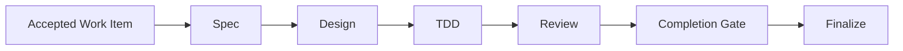
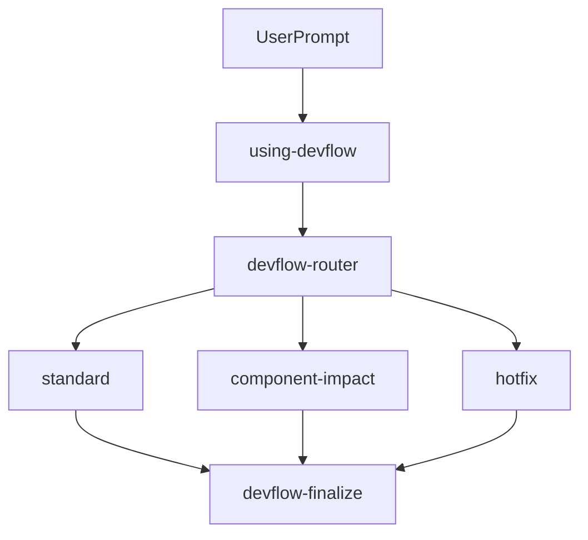

# HarnessFlow / DevFlow

[English](README.md) | [中文](README.zh-CN.md)

HarnessFlow 是一个用于构建 agent workflow skills 的工作区。当前活跃的 skill family 是 **DevFlow**：一套面向 AI Coding 开发阶段的 Cursor Agent Skills 工作流，用来把团队已经接受的 SR / AR / DTS / CHANGE work item 推进到需求澄清、设计、TDD 实现、独立评审、完成门禁和收尾。

DevFlow 不负责产品发现、商业拍板、发布运维或线上事故指挥。它的边界更清晰：从已经决定要处理的需求或问题单开始，把工程执行过程落到可追溯、可评审、可恢复的磁盘工件中。



## 为什么 AI Coding 需要 DevFlow

AI Coding 很容易从“看起来明确”的需求直接跳到改代码。短任务里这通常很快，但在真实工程中会暴露几个问题：需求假设不可回读，设计取舍没有记录，测试证据不完整，评审和实现混在一个会话里，长任务中断后只能靠聊天记忆猜下一步。

DevFlow 的核心判断是：AI 可以加速实现，但不能让工程过程消失。需求、设计、任务、证据、评审和收尾必须成为仓库里的工件，而不是只停留在对话里。

DevFlow 用四个约束解决这些问题：

- **Artifact-first**：下一步从 `features/<id>/` 和 `docs/` 中的工件恢复，而不是从聊天记忆猜。
- **Route by evidence**：`devflow-router` 根据已有工件、风险信号和 workflow state 判断下一节点。
- **Review separation**：authoring、implementation、test checker、code review、completion gate 保持角色分离。
- **Evidence-based completion**：只有规格、设计、测试、代码检视和完成证据闭环后，工作项才进入 finalize。

## DevFlow 解决什么问题

DevFlow 适合处理团队已经接受、但仍需要工程化落地的工作项：

- 把模糊的 SR / AR / CHANGE 输入澄清成可评审的 `requirement.md`。
- 在新增组件、修改组件职责、SOA 接口、依赖、状态机或运行机制时，沉淀 `component-design-draft.md` 并同步长期组件设计。
- 为单个 AR 编写代码层实现设计，将测试设计作为 AR 设计的一部分。
- 按 TDD 推进实现任务，并保留 RED / GREEN / REFACTOR 证据。
- 对测试有效性、代码质量、完成状态做独立审查。
- 对 DTS / Hotfix 先做复现、根因分析和最小安全修复边界确认。

## 核心概念

| 概念 | 说明 |
|---|---|
| Work Item | DevFlow 的输入单元，包括 SR / AR / DTS / CHANGE。 |
| Skill Node | 一个可独立触发的流程节点，例如 `devflow-specify`、`devflow-ar-design`、`devflow-code-review`。 |
| Artifact | 流程产生或消费的磁盘工件，例如 `requirement.md`、`tasks.md`、`reviews/code-review.md`。 |
| Profile | 路由密度，包括 `standard`、`component-impact`、`hotfix`、`lightweight`。 |
| Gate | 质量门禁，例如 spec review、design review、test checker、code review、completion gate。 |

## DevFlow 如何驱动工作流

日常使用时，用户可以从 `using-devflow` 开始。它是 DevFlow 的 front controller：如果用户已经明确要进入某个节点，并且磁盘工件支持这个判断，就 direct invoke 对应 skill；否则交给 `devflow-router` 先路由。

`devflow-router` 是运行时权威。它读取目标组件仓库中的 `features/<id>/`、`docs/`、评审记录和 evidence，再选择下一步。Profile 由工件和风险信号决定，不由 agent 随口选择。



### 普通 AR 路径

```text
using-devflow
  -> devflow-router
  -> devflow-specify
  -> devflow-spec-review
  -> devflow-ar-design
  -> devflow-ar-design-review
  -> devflow-tdd-implementation
  -> devflow-test-checker
  -> devflow-code-review
  -> devflow-completion-gate
  -> devflow-finalize
```

### Component Impact 路径

当工作项新增组件，或修改 SOA 服务接口、组件职责、依赖方向、状态机、运行机制、跨组件协作时，会插入组件设计与组件设计评审。

```text
devflow-router
  -> devflow-specify
  -> devflow-spec-review
  -> devflow-component-design
  -> devflow-component-design-review
  -> devflow-ar-design
  -> devflow-ar-design-review
  -> devflow-tdd-implementation
  -> devflow-test-checker
  -> devflow-code-review
  -> devflow-completion-gate
  -> devflow-finalize
```

### Hotfix / Problem Fix 路径

问题修复不能直接跳到“改代码”。Hotfix 可以压缩文档量，但不能跳过复现、根因、测试检查、代码检视和完成门禁。

```text
using-devflow
  -> devflow-router
  -> devflow-problem-fix
  -> devflow-ar-design 或 devflow-tdd-implementation
  -> devflow-test-checker
  -> devflow-code-review
  -> devflow-completion-gate
  -> devflow-finalize
```

## 安装与准备

DevFlow 当前不是 npm / pip 安装包，也没有必须执行的公共 CLI。它是一组 Cursor Agent Skills 和配套文档。

当前 DevFlow skills 位于本仓库的 `skills/` 目录。安装的本质是让 Cursor 能加载这些 `SKILL.md` 文件：可以直接在本仓库中使用，也可以把需要的 skill 目录复制到项目或团队约定的 `.cursor/skills/` 位置。

```text
skills/
  using-devflow/
  devflow-router/
  devflow-specify/
  devflow-spec-review/
  devflow-component-design/
  devflow-component-design-review/
  devflow-ar-design/
  devflow-ar-design-review/
  devflow-tdd-implementation/
  devflow-test-checker/
  devflow-code-review/
  devflow-completion-gate/
  devflow-finalize/
  devflow-problem-fix/
```

在目标组件仓库中，建议准备 `AGENTS.md` 或等价团队规则文件，用来声明构建命令、测试命令、代码规范、默认工件目录和已有团队目录的映射。没有团队覆盖时，DevFlow 使用本文档中的默认布局。

## 快速开始

直接用自然语言触发 DevFlow，不需要命令封装。

```text
Use DevFlow from this repo. Start with using-devflow.
```

```text
我要实现 AR12345，需求背景是 XXX，所属组件是 YYY。请按 DevFlow 从需求澄清开始推进。
```

```text
Continue this AR from the current artifacts and route me to the correct next step.
```

```text
这是一个 DTS / Hotfix，请先按 DevFlow 做复现、根因分析和最小修复边界。
```

也可以指定某个节点：

```text
Use DevFlow to clarify this AR requirement.
Use DevFlow to review this requirement.md.
Use DevFlow to write the AR implementation design.
Use DevFlow to implement the current active task with TDD and fresh evidence.
Use DevFlow to review the tests and then the code.
Use DevFlow to decide whether this AR can be completed.
Use DevFlow to finalize the work item.
```

第一次运行时，Agent 应先读取目标仓库约定、已有 `features/<id>/` 工件和相关 `docs/` 资产，再判断进入哪个节点。

## 使用示例

本节保留案例和截图占位，便于后续补充真实项目截图。

### 案例一：普通 AR 功能实现

适用场景：需求已经被团队接受，主要是既有组件内部行为变更，不影响组件职责、接口、依赖、状态机或运行机制。

示例输入：

```text
我要实现 AR12345，需求背景是 XXX，所属组件是 YYY，验收标准是 ZZZ。
请按 DevFlow 从需求澄清开始推进。
```

关键流程：

```text
specify -> spec review -> AR design -> AR design review -> TDD -> test checker -> code review -> completion gate -> finalize
```

预期产物：

- `features/AR12345-<slug>/requirement.md`
- `features/AR12345-<slug>/ar-design-draft.md`
- `features/AR12345-<slug>/tasks.md`
- `features/AR12345-<slug>/task-board.md`
- `features/AR12345-<slug>/implementation-log.md`
- `features/AR12345-<slug>/reviews/`
- `features/AR12345-<slug>/evidence/`
- `features/AR12345-<slug>/completion.md`
- `features/AR12345-<slug>/closeout.md`
- `docs/ar-designs/AR12345-<slug>.md`

截图占位：

```text
[TODO: 补充需求澄清截图]
[TODO: 补充任务看板截图]
[TODO: 补充 completion gate 截图]
```

### 案例二：修改组件接口或依赖关系

适用场景：AR 会修改 SOA 服务接口、参数语义、错误码、依赖方向、初始化顺序、状态机或运行时机制。

示例输入：

```text
这个 AR 会修改 XXX 组件对外接口，请按 DevFlow 判断是否需要先修订组件实现设计。
```

关键流程：

```text
specify -> spec review -> component design -> component design review -> AR design -> TDD -> reviews -> completion
```

预期产物：

- `features/<id>/requirement.md`
- `features/<id>/component-design-draft.md`
- `features/<id>/reviews/component-design-review.md`
- `features/<id>/ar-design-draft.md`
- 更新后的 `docs/component-design.md`

截图占位：

```text
[TODO: 补充 Design Options checkpoint 截图]
[TODO: 补充 component-design-draft 截图]
[TODO: 补充 component design review 截图]
```

### 案例三：DTS / Hotfix 问题修复

适用场景：输入是 DTS、线上问题、紧急缺陷或回归问题。即使时间紧，也应先确认复现、根因和最小安全修复边界。

示例输入：

```text
这是 DTS5678，现象是 XXX，复现条件是 YYY，相关日志在 ZZZ。
请按 DevFlow 先做问题复现、根因分析和最小修复边界。
```

关键流程：

```text
problem fix -> root cause -> minimal fix boundary -> TDD -> test checker -> code review -> completion gate -> finalize
```

预期产物：

- `features/DTS5678-<slug>/reproduction.md`
- `features/DTS5678-<slug>/root-cause.md`
- `features/DTS5678-<slug>/fix-design.md`
- `features/DTS5678-<slug>/evidence/`
- `features/DTS5678-<slug>/reviews/test-check.md`
- `features/DTS5678-<slug>/reviews/code-review.md`
- `features/DTS5678-<slug>/completion.md`
- `features/DTS5678-<slug>/closeout.md`

截图占位：

```text
[TODO: 补充 reproduction 截图]
[TODO: 补充 root-cause 截图]
[TODO: 补充 evidence 截图]
```

### 案例四：续跑已有工作项

适用场景：工作已经进行到一半，当前会话中断，或另一个 Agent / 开发者需要接手。

示例输入：

```text
Continue this AR from the current artifacts and route me to the correct next step.
```

关键流程：

```text
using-devflow -> devflow-router -> read artifacts -> route to next canonical node
```

预期效果：

- 读取 `features/<id>/README.md`、`progress.md`、`task-board.md`、`reviews/`、`completion.md` 等已有工件。
- 判断当前 profile 和下一节点。
- 明确哪些证据缺失，哪些节点不能跳过。

截图占位：

```text
[TODO: 补充 resume prompt 截图]
[TODO: 补充 router verdict 截图]
[TODO: 补充 resumed next step 截图]
```

## 交付结果说明

DevFlow 的交付不只是代码 diff，还包括能解释“为什么这样改、如何验证、谁审过、是否完成”的工件链。

默认过程工件位于组件仓库的 `features/<id>/`：

```text
features/<id>/
  README.md
  progress.md
  requirement.md
  component-design-draft.md
  ar-design-draft.md
  tasks.md
  task-board.md
  traceability.md
  implementation-log.md
  reviews/
    spec-review.md
    component-design-review.md
    ar-design-review.md
    test-check.md
    code-review.md
  evidence/
  completion.md
  closeout.md
```

长期资产位于组件仓库的 `docs/`：

```text
docs/
  component-design.md
  ar-designs/
    AR<id>-<slug>.md
  interfaces.md              # optional, read-on-presence
  dependencies.md            # optional, read-on-presence
  runtime-behavior.md        # optional, read-on-presence
```

问题修复还会关注：

```text
features/DTS<id>-<slug>/
  reproduction.md
  root-cause.md
  fix-design.md
```

如果目标组件仓库已有不同目录结构，DevFlow 应优先读取项目级 `AGENTS.md` 或团队规则中的等价路径。

## 质量门禁与角色分离

DevFlow 的质量门禁不是形式化步骤，而是为了防止 AI Coding 在关键位置“自我批准”。

| 节点 | 不能替代的职责 |
|---|---|
| `devflow-spec-review` | 独立判断需求是否清楚、可追溯、可设计。 |
| `devflow-component-design-review` | 独立判断组件边界、接口、依赖和运行机制是否合理。 |
| `devflow-ar-design-review` | 独立判断代码层设计和测试设计是否足以进入实现。 |
| `devflow-test-checker` | TDD 完成后审查已落地测试是否真正有效。 |
| `devflow-code-review` | 审查代码质量、架构边界、嵌入式 C/C++ 风险和可维护性。 |
| `devflow-completion-gate` | 消费已有证据并判断是否完成，不制造缺失证据。 |

因此，TDD 完成后不能直接进入 code review，必须先经过 `devflow-test-checker`。Code review 通过后也不能直接宣布完成，必须经过 `devflow-completion-gate`。

## Subagent 上下文策略

DevFlow 鼓励 controller 会话保持轻量。重代码上下文可以交给 subagent，但 subagent 只能消费明确的 context pack，不能继承完整聊天历史后自行扩大范围。

`devflow-tdd-implementation` 会为 Current Active Task 准备 Implementer Context Pack，通常包含：

```text
Work Item Type / ID
Owning Component
Current Active Task
Task Goal and Acceptance
Allowed files
Out-of-scope files
Requirement rows
AR design anchors
Test Design Case IDs
Verify commands
Evidence paths
Hard stops
```

implementer subagent 返回 `DONE`、`DONE_WITH_CONCERNS`、`NEEDS_CONTEXT` 或 `BLOCKED`。controller 将结果记录到 `task-board.md` / `implementation-log.md`，再派发 test checker 和 code review。implementer 的 self-review 不能替代独立评审。

## Design Options Checkpoint

设计 authoring skill 不允许直接隐藏一个单一方案。`devflow-component-design` 和 `devflow-ar-design` 在完整起草前都必须做 Design Options checkpoint：

- 提出 2-3 个方案。
- 展示 trade-off。
- 给出推荐方案。
- 记录确认状态。
- 只有确实低风险时才允许 `Single obvious option`，且必须写明理由。

对应 review rubric 会检查这个 checkpoint 是否存在，以及是否用 `Single obvious option` 掩盖真实决策。

## 适用边界

适合使用 DevFlow 的场景：

- 团队已经接受的 SR / AR / DTS / CHANGE。
- 需要可追溯需求、设计、测试证据和评审记录的工程任务。
- 影响组件边界、接口、依赖、状态机或嵌入式风险的变更。
- 多会话、多 Agent 或多人协作，需要从磁盘工件恢复状态的工作。

不适合使用 DevFlow 的场景：

- 从 0 到 1 的产品发现或商业方向探索。
- 没有负责人可以回答关键范围、验收标准或架构取舍的问题。
- 发布编排、线上事故指挥、运维 runbook 执行。
- 只需要一次性解释代码、回答问题或做非常小的无风险文本修改。

## 仓库结构

```text
.
  README.md
  README.zh-CN.md
  docs/
    guides/
      devflow-usage-guide.md
    principles/
      00 soul.md
      01 skill-node-define.md
      02 skill-anatomy.md
      03 artifact-layout.md
      04 workflow-architecture.md
      05 coding-principles.md
  skills/
    using-devflow/
    devflow-router/
    devflow-specify/
    devflow-spec-review/
    devflow-component-design/
    devflow-component-design-review/
    devflow-ar-design/
    devflow-ar-design-review/
    devflow-tdd-implementation/
    devflow-test-checker/
    devflow-code-review/
    devflow-completion-gate/
    devflow-finalize/
    devflow-problem-fix/
```

每个 skill 都按可独立使用来组织。共享约定和模板已经内化到各自的 `SKILL.md` 或本地 `references/` 目录中，以支持按需安装和使用。

## FAQ

### 我不知道该从哪个节点开始怎么办？

直接从 `using-devflow` 开始，描述你的目标、工作项类型、所属组件和已有材料。它会判断是 direct invoke 还是先进入 `devflow-router`。

### 已有 `features/<id>/`，怎么续跑？

让 Agent 读取当前 artifacts 并路由下一步：

```text
Continue this AR from the current artifacts and route me to the correct next step.
```

### 什么时候会进入 `component-impact`？

当工作项新增组件，或修改组件职责、SOA 接口、依赖方向、状态机、运行机制、跨组件协作，或现有组件设计缺失 / 过期时，应进入 `component-impact` 路径。

### Hotfix 能不能跳过设计？

Hotfix 可以压缩文档量，但不能跳过复现、根因分析、最小安全修复边界、测试有效性审查、代码检视和完成门禁。是否需要补 AR 设计或组件设计，由 `devflow-problem-fix` 和 router 根据风险判断。

### 为什么 TDD 后还要 `devflow-test-checker`？

TDD 产生测试，但不自动证明测试有效。`devflow-test-checker` 审查测试是否覆盖关键行为、边界、异常路径和嵌入式风险，断言是否真正证明行为，而不只是证明代码被调用。

### DevFlow 会自动创建所有文档吗？

不会。默认必须维护的是当前 work item 需要的过程工件，以及被触发的长期设计资产。`interfaces.md`、`dependencies.md`、`runtime-behavior.md` 等是 read-on-presence 的可选资产，只有团队启用或明确决定维护时才创建。

## 参考文档

- `docs/guides/devflow-usage-guide.md`：日常使用场景、提示语和常见问题。
- `docs/principles/03 artifact-layout.md`：工件布局、命名和生命周期。
- `docs/principles/04 workflow-architecture.md`：工作流路线、profile、gate 和 hard stops。
- `docs/principles/05 coding-principles.md`：DevFlow 关注的工程与代码质量原则。

## Changelog

### Unreleased

- 重写中文 README 结构，新增 AI Coding 痛点、DevFlow 价值主张、安装准备、快速开始、使用示例、交付结果、FAQ 和 Changelog。
- 将当前 DevFlow skill family 路径统一为 `skills/`，将原则文档路径统一为 `docs/principles/`。
- 为普通 AR、Component Impact、DTS / Hotfix 和续跑已有工作项补充案例骨架与截图占位。
- 保留当前关键架构约束：artifact-first、router 路由、Design Options checkpoint、TDD 后 test checker、独立 code review 和 completion gate。
