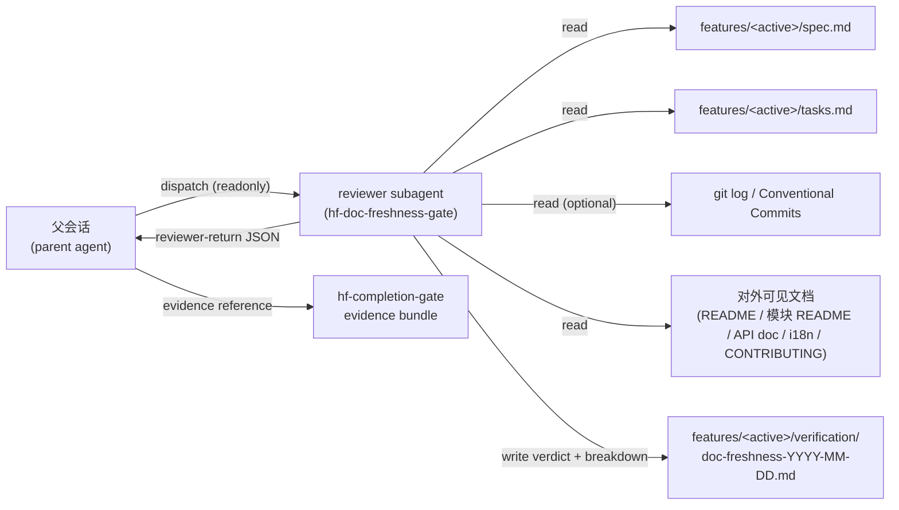
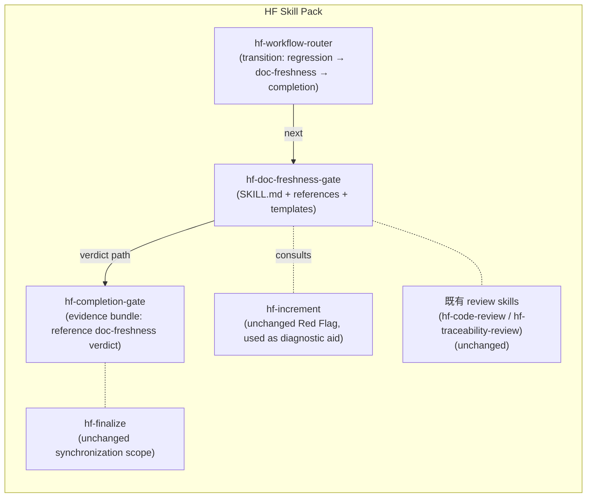

# `hf-doc-freshness-gate` 实现设计

- 状态: 草稿
- 主题: `hf-doc-freshness-gate` skill 的实现设计（架构 / 模块 / 接口 / NFR 承接）
- Workflow Profile: standard
- Execution Mode: auto
- 上游已批准规格: `features/001-hf-doc-freshness-gate/spec.md`（spec-review 通过 + 4 LLM-FIXABLE 已回修；HYP-002 closed；spec-approval-2026-04-23.md 已落盘）
- 关联 ADR: `docs/adr/0001-record-architecture-decisions.md` / `docs/adr/0002-hf-doc-freshness-gate-as-independent-node.md` / `docs/adr/0003-doc-freshness-gate-router-position-parallel-tier.md`

## 1. 概述

本设计把已批准 spec 的 8 条 FR + 4 条 NFR + 7 条 CON 转化为 HF skill pack 内的具体落地：一个新 skill 目录 `skills/hf-doc-freshness-gate/`（含 `SKILL.md` + references + 模板）+ `hf-workflow-router` 中的 transition 修改 + `hf-completion-gate` evidence bundle 中新增一项 reference + reviewer dispatch 复用既有 `hf-workflow-router/references/review-dispatch-protocol.md`。**本 skill 是纯文档（prose）skill，不引入运行时代码、工具链、依赖**——与 HF 既有 30+ 个 skill 的实现形态一致（`docs/principles/sdd-artifact-layout.md` *Discipline Without Schema / CI* 的延伸）。

## 2. 设计驱动因素

承接自 spec：

- **FR-001..FR-008**（输入消费 / verdict 输出 / sync-on-presence / profile 分级 / 与 completion-gate 衔接 / 与 finalize 不重叠 / 与 increment 不重叠 / reviewer dispatch）
- **NFR-001..NFR-004**（一致性 / lightweight 性能 ≤ 5 分钟 / ≤ 30 行 / 不依赖外部工具链 / sync-on-presence 容错）
- **CON-001..CON-007**（不破坏既有合同 / 不引入新工具链 / 遵循 sync-on-presence / 遵循角色分离 / 三 profile 支持 / readonly reviewer / 既有 evidence 路径约定）
- **HYP-003 design 阶段关闭**：通过 ADR-0003 关闭。计数口径 = **logical canonical transition 数（5 ≤ 6）**；按 per-profile 行展开 = 5 × 3 profile = 15 条，仍在 router 既有 ≥ 60 行 transition 总规模的可维护区间内（口径详见 §10.2 / ADR-0003）。
- **HYP-004 preliminarily closed by estimation**：design §10.3 提供 5 行 lightweight checklist 模板 + ≤ 4 分钟时间估算，逻辑自洽且符合 NFR-002 阈值。但 spec §4 Validation Plan 明文要求 "在 `lightweight` 项目做一次 dry run"——estimation ≠ dry-run。**final validation deferred to `hf-test-driven-dev` 阶段 §16 T-NFR-002-lightweight-time**（针对本 feature 自身做 dogfooding 实跑）；T7 walking skeleton 任务已为此预留落地点。

## 3. 需求覆盖与追溯

| spec 条目 | 设计承接 |
|---|---|
| FR-001 输入：consume user-visible behavior change list | §11 *输入 Context* + §13 输入契约表 |
| FR-002 输出：verdict + fresh evidence | §11 *Verdict & Evidence Context* + §13 输出契约表 + `verdict-record-template.md` |
| FR-003 sync-on-presence 容错 | §11 *Verdict & Evidence Context* §"维度判定流程" + NFR-004 承接行 |
| FR-004 profile 分级 | §10 lightweight 草样 + §13 输入契约表"profile 强制维度" |
| FR-005 与 `hf-completion-gate` 衔接 | §13 输出契约表 + §11 *Completion Bundle Reference* + ADR-0003 |
| FR-006 与 `hf-finalize` 不重叠 | §11 *Finalize Bundle Reference* + spec §6.2 责任矩阵 cold-link |
| FR-007 与 `hf-increment` 不重叠 | §11 *Diagnostic Aid* + spec §6.2 |
| FR-008 reviewer dispatch protocol | §11 *Reviewer Dispatch Context* 复用既有 protocol |
| NFR-001 verdict 一致性 | §14 NFR-001 行 |
| NFR-002 lightweight 性能预算 | §14 NFR-002 行 + §10 *lightweight 5 行 checklist 草样* |
| NFR-003 不依赖外部工具链 | §14 NFR-003 行 |
| NFR-004 sync-on-presence 容错 | §14 NFR-004 行 |
| CON-001..CON-007 | §11 *Boundary Constraints* §13 全表 + §15 STRIDE 跳过理由 |
| HYP-003 router FSM | ADR-0003 |
| HYP-004 lightweight | §10 + §14 NFR-002 + §16 dry run 测试 |

## 4. Domain Strategic Model (Bounded Context / Ubiquitous Language / Context Map)

HF skill pack 是单 Bounded Context 的工程治理产品（"HF Workflow Pack"），所有 skill 共享同一 Ubiquitous Language（spec / design / tasks / review / gate / closeout / verdict / fresh evidence / progress / approval / profile / Execution Mode）。本 feature 不引入新 Bounded Context，仅在既有语言中扩 1 项术语：**"对外可见文档" (User-Visible Documentation)** = spec §6.2 责任矩阵中本 gate 负责的所有 ✅ 行文档维度的总称；与既有 *长期资产 (Long-Term Assets, by `hf-finalize`)* 与 *过程交付件 (Process Artifacts, by `features/<active>/...`)* 二分（来自 `docs/principles/sdd-artifact-layout.md`）平行。

显式跳过：本 feature 不需要画 Bounded Context 清单或 Context Map，因为：

- HF skill pack 现有 30+ 个 skill 全部位于同一 Bounded Context（HF Workflow Pack）
- 本 feature 仅为既有 Context 增加一个 gate skill，未跨 Context
- 跳过理由符合 `ddd-strategic-modeling.md` *规模不匹配的项目可以直接跳过本参考* 的允许条件

## 5. Event Storming Snapshot（standard profile）

**Event Timeline**（文字时序，含异常路径）：

```text
父会话: hf-traceability-review verdict = 通过
  → 父会话: 查 router transition map → next = hf-regression-gate
  → hf-regression-gate verdict = 通过
  → 父会话: 查 router transition map → next = hf-doc-freshness-gate （★ 本节点）
  ┌───────────────────────────────────────────────────────────────────┐
  │ 父会话: 按 review-dispatch-protocol 派发 reviewer subagent (readonly)│
  │   ↓                                                                │
  │ subagent: read SKILL.md + references                               │
  │ subagent: read features/<active>/spec.md + tasks.md + commits      │
  │   → 形成 user-visible behavior change list（FR-001）                │
  │ subagent: 按 profile 激活 §6.2 ✅ 行强制维度（FR-004）              │
  │ subagent: 逐维度判定                                               │
  │   - 项目载体不存在 → N/A，evidence 标 "未启用此资产"（FR-003）     │
  │   - 本任务未触发载体变化 → N/A，evidence 标 "本 task 未触发"     │
  │   - 文档已同步 → pass                                            │
  │   - 部分维度未同步且不阻塞 closeout → partial（含未同步项清单）  │
  │   - 关键维度漂移 → blocked，next = hf-test-driven-dev           │
  │ subagent: 写 verdict + dimension breakdown 到                      │
  │   features/<active>/verification/doc-freshness-YYYY-MM-DD.md      │
  │ subagent: 返回 reviewer-return-contract JSON 给父会话              │
  └───────────────────────────────────────────────────────────────────┘
  → 父会话: 按 verdict 决定下一步
    - pass / partial / N/A → next = hf-completion-gate
      （hf-completion-gate evidence bundle 中 reference 本 verdict 文件路径）
    - blocked → next = hf-test-driven-dev（补文档变更）
  → 异常路径 1: subagent 检测到 spec/tasks 与 commit 实质不一致
    → verdict = blocked, next = hf-increment（先做范围变更分析）
  → 异常路径 2: subagent 检测到 user-visible behavior change list 三类来源全缺
    → verdict = blocked, next = hf-traceability-review（缺前置证据）
  → 异常路径 3: subagent precheck 发现 route/stage/profile/证据冲突
    → verdict = blocked(workflow), reroute_via_router=true, next = hf-workflow-router
```

**Hotspot**：reviewer subagent 在判断"本任务是否实质引入 user-visible behavior change"时存在主观性 → 由 §13 输入契约表的"判定优先级（spec FR/NFR 关联 > tasks Acceptance > Conventional Commits）"明确，并通过 NFR-001 一致性测试（同一输入两次派发 verdict 一致）兜底。

**Hotspot ↔ ADR 交叉**：上述判定优先级即 ADR-0002 决议中的"verdict 词表 + dimension breakdown 必须显式列出"的具体落地点。

## 6. 架构模式选择

本 skill 是 HF skill pack 内的**纯 prose skill**，落地形态完全继承 HF 既有 skill 的"Markdown 文档 + reviewer subagent dispatch"模式。无需选型新架构模式；显式复用既有模式：

- **Reviewer Dispatch Pattern**（来自 `skills/hf-workflow-router/references/review-dispatch-protocol.md`）：父会话派发 readonly subagent，按 reviewer-return-contract 返回结构化 verdict
- **Sync-on-Presence Pattern**（来自 `docs/principles/sdd-artifact-layout.md`）：未启用资产 = N/A，不构成 blocked
- **Profile-Aware Rigor Pattern**（来自 `docs/principles/methodology-coherence.md`）：lightweight / standard / full 三档强制维度可继承
- **Three-Section Skill Contract**（来自既有 `hf-regression-gate` / `hf-completion-gate`）：Hard Gates + Verification + fresh evidence

## 7. 候选方案总览

| 方案 | 一句话 |
|---|---|
| **A 纯 prose skill + 复用既有 reviewer dispatch + sync-on-presence**（**选定**） | 完全继承 HF 既有 skill 模式，零新工具链 |
| B 纯 prose skill + 自带轻量 helper script（如 git diff README 摘要） | skill 内含 shell helper，由 reviewer 在 setup 段执行 |
| C 引入插件式 docs-checker 接口（项目可挂自定义检查器） | skill 提供接口；项目通过 `AGENTS.md` 注册 docs-checker class/function |

## 8. 候选方案对比与 trade-offs

| 方案 | 核心思路 | 优点 | 主要代价 / 风险 | NFR / 约束适配 (对 QAS) | 对 Success Metrics 的影响 | 可逆性 |
|---|---|---|---|---|---|---|
| **A 纯 prose** | 完全沿既有 30+ skill 模式：Markdown SKILL + references + reviewer subagent | (a) 零新工具链（NFR-003 + CON-002 直接命中）；(b) sync-on-presence 与 profile 分级可直接继承 prose 形态（NFR-004 + FR-004 直接命中）；(c) 与既有 gate 三段合同形态完全一致（CON-004 命中） | reviewer subagent 判定主观性较高 → 由 NFR-001 一致性测试 + §13 输入契约表的"判定优先级"兜底 | NFR-001 通过（subagent prompt 强 deterministic）/ NFR-002 通过（lightweight 5 行 checklist 草样验证 ≤ 5 分钟）/ NFR-003 通过 / NFR-004 通过 | 直接支撑 Outcome（"成为可被冷读的 gate verdict + fresh evidence"）；Threshold "≥ 2 项目 / 3 次连续抽样无 false-pass" 可由 reviewer subagent + §13 兜底实现 | 高（删 skill 即可下线，不影响其他 skill） |
| B prose + helper script | skill 内含 `helpers/check-readme-drift.sh` 等 shell 脚本 | reviewer subagent 可在 setup 段消费脚本输出，降低主观性 | (a) 违反 NFR-003 "不依赖外部工具链"；(b) 违反 CON-002；(c) shell 脚本跨平台 / 跨 shell 兼容性维护开销；(d) reviewer 仍需冷读判定，脚本只是辅助，不替代 verdict | NFR-003 直接违反 | 与 A 同 outcome 路径，但 instrumentation debt 增加（spec §3 显式标 "无 instrumentation debt"） | 中（需删 helpers + 兼容性回退） |
| C 插件接口 | skill 提供 `docs-checker` 接口约定；项目挂自定义实现 | 灵活；可融入项目既有 docs lint 工具 | (a) 违反 YAGNI（spec 当前无多元化 docs lint 集成需求）；(b) 接口约定本身需大量 design surface；(c) 引入"接口 + 实现分层"违反 spec §6.3 "不引入新工具链"；(d) `AGENTS.md` 既有覆盖语义已足以承接"项目想加自定义检查器" | NFR-003 表面合规但实际把工具链负担推给项目方 | 提高了 instrumentation debt；与 spec §3 Non-goal "不追求 docstring 覆盖率到某个百分比" 相冲突 | 低（接口约定一旦发布，下线需走 deprecation 流程） |

**选定 = A**。理由：(1) 零新工具链直接满足 NFR-003 + CON-002；(2) 完全继承既有 30+ HF skill 形态，cold reader / 后续 maintainer 几乎零认知成本；(3) Hotspot（reviewer 主观性）由 §13 输入契约表的"判定优先级" + NFR-001 一致性测试两层兜底，落地路径明确；(4) 候选 B / C 均违反 spec 已批准的 NFR-003 或 CON-002，强行采用等于把 spec 决策推翻。

## 9. 选定方案与关键决策

选定 = 方案 A（纯 prose skill + 复用既有 reviewer dispatch + sync-on-presence）。三条关键决策已落到 ADR pool：

- ADR-0001：启用 `docs/adr/` ADR pool（元决策，本仓库首个 ADR）
- ADR-0002：`hf-doc-freshness-gate` 作为独立 gate 节点（vs 扩 finalize / 嵌 review）
- ADR-0003：在 router 中位于 `hf-regression-gate` 之后、`hf-completion-gate` 之前（HYP-003 dry run 通过）

## 10. 架构视图（C4 + lightweight checklist 草样）

### 10.1 C4 Context



### 10.2 C4 Container（HF skill pack 内）



### 10.3 lightweight 5 行 checklist 草样（HYP-004 dry run）

```markdown
## Lightweight Doc-Freshness Checklist（profile=lightweight, ≤ 5 行 / ≤ 5 分钟）

1. [仓库根 README 产品介绍段] 本任务 user-visible behavior change list 是否需要更新该段？(yes / no / N/A) — verdict 与理由
2. [Conventional Commits `docs:` 自检] 若 yes 且未见 `docs:` 类 commit，标 partial 或 blocked
3. evidence 文件名 + 一句话总结（≤ 1 行）
4. 维度判定明细（≤ 1 行）
5. next action（≤ 1 行）
```

dry run 估算：reviewer subagent 读 spec / tasks（≤ 1 分钟）+ 看 README 与 commits（≤ 2 分钟）+ 写 5 行 verdict（≤ 1 分钟）≈ **总计 ≤ 4 分钟**，满足 NFR-002 ≤ 5 分钟。生成的 5 行 verdict 文件 ≤ 30 行（含 metadata header），满足 NFR-002 ≤ 30 行。HYP-004 dry run 通过。

## 11. 模块职责与边界

`skills/hf-doc-freshness-gate/` 内部分工：

| 组件 | 职责 | 不承担 |
|---|---|---|
| `SKILL.md` | 单一权威 prose contract：Methodology / When to Use / Hard Gates / Workflow / Output Contract / Reference Guide / Red Flags / Verification | 模板正文（拆到 templates/）；详细 rubric（拆到 references/） |
| `references/responsibility-matrix.md` | spec §6.2 责任矩阵的权威 cold-link（reviewer subagent 必读） | spec FR/NFR 复述 |
| `references/profile-rubric.md` | lightweight / standard / full 三档强制维度判定细则 + 各维度判定优先级 | profile 切换逻辑（router 负责） |
| `references/reviewer-dispatch-handoff.md` | 复用 `hf-workflow-router/references/review-dispatch-protocol.md` 的本 gate 适配点 | 通用 dispatch 协议（链向上游 reference） |
| `templates/verdict-record-template.md` | `features/<active>/verification/doc-freshness-YYYY-MM-DD.md` 的模板（含 metadata header / 判定明细表 / 结构化返回 JSON） | reviewer 推理逻辑 |
| `templates/lightweight-checklist-template.md` | §10.3 的 5 行 checklist 模板 | profile 判定 |
| `evals/test-prompts.json` | 至少 5 个 pressure scenario：(a) 全部 N/A 路径 (b) pass 路径 (c) partial 路径 (d) blocked → hf-test-driven-dev 路径 (e) blocked(workflow) → router 路径 | 真实生产用例 |

**Boundary Constraints**（来自 spec CON-001..CON-007 + §6.2）：

- 本 skill 不修改 `hf-finalize` / `hf-completion-gate` / `hf-code-review` / `hf-traceability-review` / `hf-increment` 的 SKILL.md
- 本 skill 修改：(1) `hf-workflow-router/references/profile-node-and-transition-map.md`（按 ADR-0003 加入 logical canonical 5 条 transition；按 per-profile 行展开 = 5 × 3 = 15 行）；(2) `hf-completion-gate/SKILL.md`（在 evidence bundle 部分新增一项 reference，prose-only，不改 verdict 逻辑）
- **completion-gate evidence bundle 消费规则**：仅 `pass` / `partial` / `N/A` 三档 verdict 进入 `hf-completion-gate` evidence bundle 作为 reference；`blocked` verdict 由本 gate 直接路由回 `hf-test-driven-dev`（spec FR-005 第三条 acceptance 的隐含路径），不进入 completion-gate。这与 "不改 completion-gate verdict 逻辑" 一致——completion-gate 只新增 evidence 引用，不引入 doc-freshness blocked 的额外判定分支
- 修改范围最小化原则：每处修改不超过 prose-level 的 1–2 段插入

## 12. 数据流、控制流与关键交互

详见 §5 Event Storming Snapshot。关键不变量：

- **不变量 I1**: reviewer subagent 必须 readonly（CON-006）
- **不变量 I2**: verdict ∈ `{pass, partial, N/A, blocked}` 四值之一（FR-002）
- **不变量 I3**: 同一输入两次 dispatch 必须返回相同 verdict + 相同 dimension breakdown（NFR-001，允许 timestamp 不同）
- **不变量 I4**: 若 spec/tasks/commits 三类来源全缺 → verdict = blocked，next = `hf-traceability-review`（FR-001 负路径）
- **不变量 I5**: spec 与 commits 实质不一致 → verdict = blocked，next = `hf-increment`（FR-007 负路径）
- **不变量 I6**: 未启用文档载体 → verdict 该维度 = `N/A`（≠ blocked）（FR-003 + NFR-004）

## 13. 接口、契约与关键不变量

### 13.1 输入契约表

| 输入 | 来源 | 必填 | 缺失时行为 | 判定优先级 |
|---|---|---|---|---|
| user-visible behavior change list | 1. `features/<active>/spec.md` 关联 FR/NFR；2. `features/<active>/tasks.md` Acceptance；3. Conventional Commits `feat:` / `fix:` / `BREAKING CHANGE:` / `docs:` | 至少一类 | 全缺 → verdict=blocked → `hf-traceability-review` | spec FR/NFR 关联 > tasks Acceptance > Conventional Commits（按可信度） |
| `Workflow Profile` | `features/<active>/progress.md` `Workflow Profile` 字段 | 必填 | 缺失 → verdict=blocked(workflow) → router | — |
| 项目对外可见文档载体 | 文件系统扫描（仓库根 README.md / 模块 README / OpenAPI / docstring 文件 / i18n 副本 / CONTRIBUTING.md / docs/ 站点 source） | 全可选 | 任一不存在 → 该维度 verdict=`N/A`（FR-003） | — |
| `AGENTS.md` 项目级覆盖 | 仓库根 `AGENTS.md` | 可选 | 缺失 → 用 SKILL 默认值 | 项目覆盖 > skill 默认 |
| **Profile 强制维度（FR-004）** | `references/profile-rubric.md` | 必填（按 profile） | — | lightweight: 仅 row 1（README 产品介绍段）+ Conventional Commits 自检；standard: + 公共 API + i18n 副本 + CONTRIBUTING；full: spec §6.2 全部 ✅ 行 |

### 13.2 输出契约表

| 输出 | 路径 | 必有 | 内容契约 |
|---|---|---|---|
| verdict 文件 | `features/<active>/verification/doc-freshness-YYYY-MM-DD.md` | ✅ | metadata header + verdict (`pass`/`partial`/`N/A`/`blocked`) + dimension breakdown 表 + 结构化返回 JSON（按 reviewer-return-contract）+ evidence file 引用 |
| optional diff log | `features/<active>/evidence/doc-freshness-diff-*.log` | 可选 | 若 reviewer 在判定时引用了具体 file diff，归档到此 |
| `hf-completion-gate` evidence bundle | `hf-completion-gate` SKILL.md prose 中新增一项 reference | ✅ | "doc-freshness verdict path" 作为既有 evidence bundle 的一项 |

### 13.3 与既有 reviewer-return-contract 的衔接

复用 `skills/hf-workflow-router/references/reviewer-return-contract.md`（既有 protocol）。本 gate 的 reviewer-return JSON 字段：

```json
{
  "conclusion": "pass" | "partial" | "N/A" | "blocked",
  "next_action_or_recommended_skill": "hf-completion-gate" | "hf-test-driven-dev" | "hf-increment" | "hf-traceability-review" | "hf-workflow-router",
  "record_path": "features/<active>/verification/doc-freshness-YYYY-MM-DD.md",
  "key_findings": [...],
  "needs_human_confirmation": false,
  "reroute_via_router": false,  // true only when verdict=blocked(workflow)
  "dimension_breakdown": [...]
}
```

## 14. 非功能需求与 QAS 承接

| NFR ID | ISO 25010 维度 | 规格 QAS 摘要 (Source→Stimulus→Env→Response→Measure) | 设计承接模块 / 机制 | 可观测手段（logs/metrics/traces） | 验证方法 | 失败模式 & 缓解 | ADR 锚点 |
|---|---|---|---|---|---|---|---|
| NFR-001 | Functional Suitability / Correctness | 同一输入 / 两次 reviewer dispatch / 同环境 / verdict 与 breakdown 一致 / 抽样 ≥ 5 次 100% 一致 | reviewer subagent prompt（`SKILL.md` Workflow 段）+ `references/profile-rubric.md` 判定优先级表 | logs: subagent invocation log；可手动检查 verdict file 内容 hash | §16 测试用例 NFR-001 一致性回归（同一 spec/tasks/commits 输入下两次派发，diff verdict 文件） | 主观性导致漂移 → 缓解：判定优先级表 + verdict-record-template metadata 字段强制要求 reviewer 列出"判定时 consume 了哪些 input file" | ADR-0002 |
| NFR-002 | Performance Efficiency / Time behavior | 父会话（lightweight profile）/ dispatch reviewer / lightweight 项目 / 完成 verdict / ≤ 5 分钟 + ≤ 30 行 | `references/profile-rubric.md` lightweight 段：仅 row 1 + Conventional Commits 自检 | 手动: verdict 文件行数；reviewer 自报耗时（subagent prompt 要求） | §16 测试用例 NFR-002 dry run（按 §10.3 5 行 checklist 模板手动跑一次） | 项目 docs 极大 → 缓解：lightweight 不强制全表，按 row 1 优先；rower 自报超时 → escalate to standard | ADR-0002 + ADR-0003（router 落点直接决定 lightweight 路径上的 reviewer dispatch 总开销） |
| NFR-003 | Maintainability / Modularity | 项目（无任何外部 docs lint 工具链）/ 启用本 gate / 任一环境 / gate 仍能 verdict / 缺失工具不构成 blocked | `SKILL.md` 显式声明 "可选工具由 `AGENTS.md` 声明"；reviewer 仅基于文件内容冷读判定 | 无（跳过工具 = 默认通路） | §16 测试用例 NFR-003 在无任何 lint 工具的最小项目跑一次（本仓库自身就是 baseline） | 项目方误以为强制工具链 → 缓解：`SKILL.md` Red Flags 显式列出 "误以为强制 lint 工具" | ADR-0002 |
| NFR-004 | Reliability / Fault tolerance | 项目（未启用某文档载体）/ gate 判定该维度 / 任一 profile / N/A + 显式标注 / 不构成 blocked | `references/profile-rubric.md` "判定流程" 段：先文件系统检测，再判定；`templates/verdict-record-template.md` 显式 N/A 行 | 无 | §16 测试用例 NFR-004 在缺失模块 README 的项目跑一次（本仓库自身就是 baseline，无 packages/ / src/ 子目录）| 误判 N/A 为 blocked → 缓解：reviewer subagent prompt 显式列出 "未启用 ≠ blocked" 警句 | ADR-0002 + ADR-0003（router 路径上 N/A verdict 仍需进入 completion-gate evidence bundle，与 router 节点位置直接相关） |

## 15. Threat Model (STRIDE 轻量版)

**触发条件评估**：

- spec 中是否有 Security NFR？❌ 无（NFR-001..NFR-004 均非 Security 类）
- 是否涉及用户认证 / 授权？❌ 无
- 是否存在跨信任边界数据流？❌ 无（本 skill 是 prose contract，运行在 reviewer subagent 进程内，不跨进程 / 不跨网络）
- 是否处理个人数据 / 敏感配置 / 凭证？❌ 无
- 是否有审计 / 合规要求？❌ 无（当前 spec / discovery 均未声明）

**结论：跳过 STRIDE list**。理由符合 `threat-model-stride.md` *何时跳过* 段第二条："纯文档 / 元数据变更，无代码路径"——本 skill 是纯 prose skill，不引入运行时代码。如未来 Phase 2 引入 `hf-security-gate` 后本 gate 与之产生 evidence bundle 集成，应在 `hf-increment` 流程中重新评估。

## 16. 测试与验证策略

本 skill 是 prose skill，"测试"形态以 **prompt-based pressure scenarios + 手动 dry run** 为主，落到 `evals/test-prompts.json`（与 HF 既有 30+ skill 的 evals 形态一致）。

**Walking Skeleton（最薄端到端）**：手动跑一次 §10.3 lightweight checklist 模板，针对**本 feature 自身**（`features/001-hf-doc-freshness-gate/`）作为被测对象（"HF 自适配 dogfooding"）。这是最薄端到端路径——所有 8 条 FR / 4 条 NFR 都可被一次 dry run 覆盖。

**测试策略表**：

| 测试 ID | 验证目标 | 类型 | 实施方法 | 期望结果 |
|---|---|---|---|---|
| T-FR-001-pass | 三类输入齐全时 verdict 路径 | prompt scenario | `evals/test-prompts.json` scenario #1：给 reviewer 提供 spec + tasks + commits | verdict=pass，evidence 文件引用全部三类来源 |
| T-FR-001-blocked | 三类输入全缺时 verdict 路径 | prompt scenario | scenario #2：给 reviewer 提供空 spec/tasks/无 commits | verdict=blocked，next=hf-traceability-review |
| T-FR-003-N/A | 文档载体不存在时 N/A 路径 | prompt scenario | scenario #3：项目无模块 README | dimension=N/A，evidence 标"未启用此资产" |
| T-FR-005-partial | partial verdict 路径与 next | prompt scenario | scenario #4：仓库根 README 已更新但 OpenAPI 漂移 | verdict=partial，未同步项清单含 OpenAPI |
| T-FR-007-blocked-increment | spec 与 commits 不一致时 next=hf-increment | prompt scenario | scenario #5：commits 引入新 endpoint 但 spec 未更新 | verdict=blocked，next=hf-increment |
| T-NFR-001-consistency | 同一输入两次 dispatch verdict 一致 | manual dry run | 对 scenario #1 派发两次（不同 timestamp），diff verdict 文件 | verdict + dimension breakdown 完全一致（timestamp 除外）|
| T-NFR-002-lightweight-time | lightweight 模式 ≤ 5 分钟 / ≤ 30 行 | manual dry run | 对本 feature 自身按 §10.3 模板手动跑一次 | 总耗时 ≤ 5 分钟，verdict 文件 ≤ 30 行 |
| T-NFR-003-no-tools | 无外部 lint 工具时 gate 仍可 verdict | manual dry run | 在本仓库跑一次（本仓库无任何 docs lint）| verdict 正常输出 |
| T-NFR-004-sync-on-presence | 未启用资产维度 = N/A | manual dry run | 在本仓库（无 packages/）对模块 README 维度判定 | dimension=N/A，evidence 标"未启用" |

**最薄端到端路径**：T-NFR-002-lightweight-time + T-NFR-003-no-tools + T-NFR-004-sync-on-presence 三个 manual dry run 共享同一被测对象（本 feature 自身），可在 hf-test-driven-dev 阶段一次完成；这就是 Walking Skeleton 的具体落地。

## 17. 失败模式与韧性策略

按 `failure-modes.md` 四层框架：

| 失败模式 | 关键路径触发 | 缓解策略 |
|---|---|---|
| **Crash** | reviewer subagent 进程崩溃 | 由 HF 既有 subagent dispatch 协议处理（重试 / 父会话 fallback）；本 gate 不自定义 |
| **Hang** | reviewer 在 lightweight 模式下耗时 > 5 分钟 | NFR-002 显式阈值 + reviewer subagent prompt 要求自报耗时；超时 → reviewer 应输出 partial verdict + escalation 建议（升级到 standard profile） |
| **Wrong** | reviewer 误判 N/A 为 blocked，或误判 blocked 为 pass | NFR-001 一致性测试 + §13 输入契约表的"判定优先级"+ Red Flags 显式列出常见错误模式；spec §6.2 责任矩阵作为冷读权威 |
| **Silent** | reviewer 漏检某个 ✅ 行维度但 verdict=pass | `templates/verdict-record-template.md` 强制要求 reviewer 列出"本次 dispatch 覆盖了哪些维度"；漏写视为 blocked |

## 18. 任务规划准备度

下游 `hf-tasks` 可基于本设计直接拆出以下原子任务（后续 hf-tasks 阶段会正式 INVEST 拆解）：

- T1: 创建 `skills/hf-doc-freshness-gate/SKILL.md`
- T2: 创建 `skills/hf-doc-freshness-gate/references/{responsibility-matrix.md, profile-rubric.md, reviewer-dispatch-handoff.md}`
- T3: 创建 `skills/hf-doc-freshness-gate/templates/{verdict-record-template.md, lightweight-checklist-template.md}`
- T4: 创建 `skills/hf-doc-freshness-gate/evals/test-prompts.json`（5 scenarios）
- T5: 修改 `skills/hf-workflow-router/references/profile-node-and-transition-map.md`（按 ADR-0003 插入 5 条 transition）
- T6: 修改 `skills/hf-completion-gate/SKILL.md`（evidence bundle 段新增一项 reference，prose-only）
- T7: 手动 dry run（T-NFR-002 + T-NFR-003 + T-NFR-004 walking skeleton）

依赖图：T1 → T2 → T3 → T4 → T5 / T6（并行）→ T7（最薄端到端）。所有任务均无外部依赖，全部可在 hf-test-driven-dev 单 session 内完成。

## 19. 关键决策记录（ADR 摘要）

- **ADR-0001 启用 ADR pool**（元决策）→ `docs/adr/0001-record-architecture-decisions.md`
- **ADR-0002 hf-doc-freshness-gate 作为独立 gate 节点**（vs 扩 finalize / 嵌 review）→ `docs/adr/0002-hf-doc-freshness-gate-as-independent-node.md`
- **ADR-0003 router 位置：regression 之后、completion 之前**（HYP-003 计数口径 = logical canonical 5 ≤ 6）→ `docs/adr/0003-doc-freshness-gate-router-position-parallel-tier.md`

### 19.1 ADR-0002 ↔ ADR-0003 reconcile 注

ADR-0002 决策段 "**与 hf-regression-gate / hf-completion-gate 同 tier**" 与 ADR-0003 决策 "P3：regression 之后、completion 之前 sequential" 在不同维度上各自成立，不矛盾：

- **ADR-0002 "同 tier" = logical gate tier**：指本 skill 与既有 `hf-regression-gate` / `hf-completion-gate` 同属"gate 类型节点"逻辑档位（与 review / authoring / closeout 节点档位区分），共享三段合同（Hard Gates + Verification + fresh evidence）+ reviewer dispatch + readonly subagent 等通用形态
- **ADR-0003 P3 sequential = topology position**：指在 router transition map 上的具体拓扑位置——**位于** regression 之后、completion 之前，**不与** 二者并行

cold reader 读 ADR 顺序应为：先 ADR-0002（确定本 skill 是 gate 类节点）→ 再 ADR-0003（确定具体 sequential 拓扑位置）。design §10.2 C4 Container 图与 §5 Event Storming Snapshot 均按 ADR-0003 P3 sequential 拓扑绘制，是设计的最终落地形态。

### 19.2 ADR-0003 文件 slug 命名遗留注

ADR-0003 文件 slug `0003-doc-freshness-gate-router-position-parallel-tier.md` 含 "parallel-tier" 字样，系起草中途从候选 P2（与 regression / completion 平行同 tier）切换到 P3（sequential 在 regression 与 completion 之间）后未同步的命名遗留。按 `sdd-artifact-layout.md` *ADR 永不删除、永不重新编号、不复用、不改名* 约定，文件名不动；以 ADR-0003 决策段（P3 sequential）为准。

## 20. 明确排除与延后项

- **不引入** docstring / API doc 自动生成、自动翻译、产品 marketing 站点 CI（spec §6.3 + §7 永久 out of scope）
- **不引入** docs lint / spell-check 工具链（spec §7 永久 out of scope）
- **不修改** `hf-finalize` / `hf-code-review` / `hf-traceability-review` / `hf-increment` 任何 SKILL.md（CON-001）
- **不为** monorepo 多包 verdict aggregation 设计（spec §13 Q2 留 design 阶段考虑→ 本设计：明确**不做**，按现有"模块 README"维度逐文件判定，aggregation 留 Phase 1+ `hf-increment` 演进）
- **不定义** PR template "User-Visible Changes" 字段（spec §13 Q3 留 `AGENTS.md` 声明）
- **延后到 Phase 2 hf-security-gate**：本 skill 与 security gate 的 evidence bundle 集成（§15 STRIDE 跳过段已说明）

## 21. 风险与开放问题

### 阻塞（送 design-review 前必须关闭或降级）

无。

（HYP-003 通过 ADR-0003 关闭，计数口径 = logical canonical 5 ≤ 6；HYP-004 **preliminarily closed by estimation in design §10.3，final validation deferred to T-NFR-002 in `hf-test-driven-dev` 阶段**；本设计无新增 Blocking 假设。）

### 非阻塞（保留至 hf-tasks 或后续阶段处理）

- **Q1（非阻塞）**：reviewer subagent 在判断"本任务是否实质引入 user-visible behavior change"时仍有主观性 → 由 §13 输入契约表 + NFR-001 一致性测试 + Red Flags 三层兜底；如未来出现重复主观漂移，应通过 `hf-bug-patterns` 沉淀模式
- **Q2（非阻塞）**：本 skill 自身 dogfooding 路径（"用 hf-doc-freshness-gate 评估 hf-doc-freshness-gate 的 README 是否漂移"）需要 chicken-and-egg 启动；hf-tasks 阶段会把 T7（walking skeleton）显式标记为 dogfooding 任务

## Task Planning Readiness

✅ 设计已足以支撑 `hf-tasks` 拆解：

- 模块 / 文件级落地点全部列出（§11 + §13 + §18）
- 关键决策已用 ADR 锁定（ADR-0001 / 0002 / 0003）
- NFR 全部映射到具体模块 / 验证（§14）
- 失败模式四层覆盖（§17）
- Walking Skeleton 路径明确（§16）
- HYP-003 / HYP-004 dry run 通过
- 无新增 Blocking 假设
