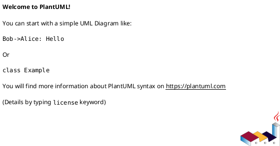

# AR 实现设计说明书

使用说明：

- 本模板用于 `devflow-ar-design` 产出 `features/<id>/ar-design-draft.md`，并在 closeout 后 promote 到 `docs/ar-designs/AR<id>-<slug>.md`。
- 正式交付件必须删除模板说明、示例业务内容和任何占位符；不得残留 `AI提示`、`TBD`、`{DATE}`、变量替换规则等模板痕迹。
- 测试设计必须是本文档章节，不得拆成独立 `test-design.md`。
- 本模板完整继承旧 `ar-template.md` 的作业结构：AR 概述、动态行为、功能点分解、实现设计、MDC 场景设计、重构设计、测试设计、模板修订记录均为必填骨架。

## 1. AR 概述（必要）

描述 AR 的基本信息，包括组件名称和命名。

| 字段 | 内容 |
|---|---|
| 工作项 ID |  |
| AR 系统流水号 |  |
| AR 描述 |  |
| 所属组件 |  |
| 关联 IR / SR |  |
| Owner / 开发负责人 |  |
| 组件基线 | `docs/component-design.md` 章节 / 版本锚点 |

## 2. 动态行为（必要）

### 2.1 交互时序图

使用 PlantUML 描述本 AR 涉及的内部模块、外部服务、SDK、硬件或协议栈交互。参与者应使用真实组件 / 类 / 服务名，消息应体现接口或方法调用。

```plantuml
@startuml
autonumber
' TODO: 替换为真实参与者和调用
@enduml
```

## 3. 功能点分解（必要）

针对本需求详细分解具体功能点，以便开发和测试对功能细节对齐。此部分应由开发、测试共同参与需求澄清后输出，作为双方统一认识的载体。测试用例以覆盖此处功能点为目标进行设计。功能点必须可回指到 `requirement.md` 的 row ID，并能被第 6 章测试设计覆盖。

| 序号 | 功能点 ID | Covers Requirement | 功能点名称 | 功能点描述 | 优先级 | 可独立测试 |
|---|---|---|---|---|---|---|
| 1 |  |  |  |  | high / medium / low | 是 / 否 |

## 4. 实现设计（必要）

### 4.0 Design Options / 方案选择（必要）

在写完整实现设计前记录候选方案、trade-off、推荐项和确认状态。若只有一个显然方案，写 `Single obvious option` 并说明为什么不展开多方案。

| Option | 改动范围 | 控制流 / 数据结构要点 | 测试策略 | 风险 | 成本 / 取舍 | 结论 |
|---|---|---|---|---|---|---|
| A |  |  |  |  |  | recommended / rejected |
| B |  |  |  |  |  | recommended / rejected |

- Recommended Option:
- Rationale:
- 确认负责人: 开发负责人 / 模块架构师
- 确认状态: confirmed / pending / N/A（单一明显方案）

### 4.1 功能实现思路（必要）

描述清楚从规格到代码的实现思路，体现需求相关人（BA、开发、测试等）对系统实现诉求和理解一致，能够支持后续评估开发工作量。至少覆盖：

- 代码重构需求分析
- 新增 / 修改类清单
- 业务流程与异常流程
- 现有功能影响评估
- 代码移植说明（如有）
- 与 `docs/component-design.md` 的一致性说明

### 4.2 功能实现设计（必要）

本章节写设计与实现的具体内容；对于流程编排必须提供流程图、时序图等。若需求涉及大量用户交互或业务流程，需要针对场景汇总说明。

#### 4.2.1 用例图（如有）



#### 4.2.2 流程图


#### 4.2.3 流程说明

**正常流程**：

1. 

**异常流程**：

1. 

### 4.3 数据库及文件持久化设计（可选）

如果涉及数据库操作，本章节写数据模型设计说明，包含表结构变化、字段说明、原表数据量级、数据割接逻辑、回退逻辑等。其他文件操作（如 sharepf、配置文件、持久化文件）也需说明。若有数据割接，必须说明割接和回滚逻辑。

#### 4.3.1 表结构设计

| 表 / 文件 | 变更内容 | 数据量级 | 割接逻辑 | 回滚逻辑 |
|---|---|---|---|---|
|  |  |  |  |  |

#### 4.3.2 字段说明

| 字段名 | 类型 | 主键 | 可空 | 描述 |
|---|---|---|---|---|
|  |  | 是 / 否 | 是 / 否 |  |

#### 4.3.3 数据割接（如有）

- 割接逻辑:
- 回滚逻辑:

### 4.4 接口描述（必要）

按照 AR 上下文关系图，描述与服务器、第三方 SDK、内部模块 / 服务 / 组件的新增或修改接口。涉及服务器接口时，说明关键变更点并引用接口定义地址；涉及第三方 SDK 时，引用具体 SDK 接口文档地址；内部接口在本章节直接描述。接口变更必须基于组件基线增量说明，不得在 AR 中重新定义组件级架构。

| 序号 | 接口名 | 所属方 | 描述 | 参数 | 返回值 / 错误码 | 并发约束 | 兼容性影响 |
|---|---|---|---|---|---|---|---|
| 1 |  |  |  |  |  |  |  |

### 4.5 GUI 界面（可选）

涉及 UI / HMI / 配置界面时必须输出，结合高保真模型或界面原型说明；不涉及 UI 时写明“不涉及”及理由。

### 4.6 代码设计（必要）

针对 AR 上下文中的框图对代码层级做设计，重点说明模块化 / 组件化涉及的要点。如果涉及多仓，需要全部列举；涉及 MVP 的需提前思考并向 MVP 靠拢。

#### 4.6.1 包 / 目录结构设计

| 包 / 目录路径 | 描述 | 包含类 / 文件 | 变更类型 |
|---|---|---|---|
|  |  |  | 新增 / 修改 / 删除 |

#### 4.6.2 类设计

| 类名 | 文件路径 | 职责 | 公开 API | 变更类型 |
|---|---|---|---|---|
|  |  |  |  |  |

#### 4.6.3 类图


### 4.7 MDC 场景设计（必要）

每个场景均需填写。回答“不涉及”时必须给出判定依据。

#### 4.7.1 并发场景分析

针对代码中涉及的并发场景进行分析和设计（线程和数据保护），并考虑未来支持并发的可能性。

| 分析项 | 内容 |
|---|---|
| 是否涉及并发 | 是 / 否 |
| 判定依据 |  |
| 并发场景描述 |  |
| 线程 / 中断 / 任务模型 |  |
| 线程保护机制 |  |

#### 4.7.2 启动退出分析

针对需求代码中涉及功能，分析对进程启动和退出的影响，并针对场景给出设计和处理。

| 分析项 | 内容 |
|---|---|
| 是否涉及启动 / 退出 | 是 / 否 |
| 判定依据 |  |
| 影响评估 |  |
| 处理策略 |  |

#### 4.7.3 休眠唤醒分析

针对需求代码中涉及功能，分析对休眠唤醒场景下的影响，并针对场景给出设计和处理。

| 分析项 | 内容 |
|---|---|
| 是否涉及休眠唤醒 | 是 / 否 |
| 判定依据 |  |
| 影响评估 |  |
| 处理策略 |  |

#### 4.7.4 可靠性分析

重点针对与周边模块（包括硬件）交互的可靠性设计，如启动时序、依赖关系、断链、超时、部分失败等。

| 分析项 | 内容 |
|---|---|
| 可靠性要求 |  |
| 外部依赖 / 硬件交互 |  |
| 断链 / 超时 / 部分失败处理 |  |
| 降级 / 重试 / 告警策略 |  |

#### 4.7.5 进程 SELinux 权限分析

明确本进程究竟需要触碰系统的哪些部分，并给出主体对象、客体对象、主客体访问关系及其 SELinux 规则基线。

| 分析项 | 内容 |
|---|---|
| 是否涉及权限变化 | 是 / 否 |
| 判定依据 |  |
| 主体对象 | 进程 / 服务 / 可执行文件 / 线程上下文等发起访问的一方 |
| 主体标签基线值 | 当前 SELinux domain / type / context，例如 `<subject_domain>`；注明来源（现网策略、基线版本、审计日志、源码配置等） |
| 客体对象 | 文件 / 目录 / 设备节点 / socket / binder / property / IPC / 系统资源等被访问的一方 |
| 客体标签基线值 | 当前 SELinux type / context，例如 `<object_type>`；注明来源（file_contexts、property_contexts、策略文件、审计日志等） |
| 主客体访问关系 | `<主体对象>` 对 `<客体对象>` 的访问动作，例如 read / write / getattr / open / ioctl / connectto / call / set |
| 规则基线值 | 当前 allow / neverallow / dontaudit / type_transition 等策略规则基线；说明是否已有规则、是否需新增 / 修改 / 删除 |
| 权限变化说明 | 本 AR 是否改变主体、客体、标签或访问动作；若不变化，说明沿用基线的理由 |
| 权限申请与风险 | 新增或放宽规则的必要性、最小权限证明、误授权风险、回退策略 |

## 5. 重构设计（可选）

如本 AR 需要重构，必须说明触发原因、范围、受影响模块和验证方式；跨组件边界或跨 >=3 模块结构性重构应回 `devflow-router`。

| 重构项 | 描述 | 影响模块 | 验证方式 | 是否触发升级 |
|---|---|---|---|---|
|  |  |  |  | 是 / 否 |

## 6. 测试设计（必要）

对接口、算法、关键功能进行测试策略和测试场景设计，同时对可测试性需求进行设计。测试设计驱动后续 `devflow-tdd-implementation` 与 `devflow-tdd-implementation`。每个用例必须回指功能点和 requirement row。

### 6.1 测试点汇总

| Case ID | Covers Requirement | 覆盖功能点 | Test Level | Coverage Type | 测试因子 | 组合方式 | 逻辑覆盖程度 |
|---|---|---|---|---|---|---|---|
| TC-001 |  |  | unit / integration / simulation | happy / boundary / exception / embedded-risk |  | Pairwise / 全遍历 / 指定组合 | 语句 / 判定 / 路径 |

**测试因子组合说明**：

- Pairwise 组合覆盖：将所有测试因子的取值两两组合，保证任意 2 个因子的所有取值组合至少被覆盖一次，可达到约 80% 逻辑覆盖。
- 全遍历组合：所有测试因子取值的全面组合。

**逻辑覆盖程度说明**：

- 语句覆盖：设计若干测试用例，运行被测程序，使每一可执行语句至少执行一次。
- 判定覆盖：也叫分支覆盖，使程序中每个判断的取真分支和取假分支至少执行一次。
- 路径覆盖：设计足够多的测试用例，覆盖程序中所有可能路径。

### 6.2 单元测试（UT）

单元测试主要覆盖哪些功能点。

| 用例 ID | 功能点 | 前置条件 | 步骤 / 触发 | 预期结果 | Mock / Stub / 仿真 | RED / GREEN 证据计划 |
|---|---|---|---|---|---|---|
|  |  |  |  |  |  |  |

### 6.3 接口测试

接口测试必须按照接口说明来测试，包括必选字段、可选字段、字段长度、错误码等校验。

| 用例 ID | 接口名 | 测试类型 | 测试内容 | 预期结果 |
|---|---|---|---|---|
|  |  | 必选字段 / 可选字段 / 字段长度 / 错误码 |  |  |

### 6.4 业务场景测试

描述涉及的业务 / 功能场景。

| 用例 ID | 场景 | 测试步骤 | 预期结果 |
|---|---|---|---|
|  |  |  |  |

### 6.5 异常场景测试

描述异常场景下的可靠性测试，包括交互部件之间的断链 / 超时、批处理消息全部失败 / 部分失败 / 全部成功等。

| 用例 ID | 场景 | 处理方式 | 预期结果 |
|---|---|---|---|
|  |  |  |  |

### 6.6 嵌入式风险覆盖矩阵

| 嵌入式风险维度 | 覆盖该维度的 Case ID | 说明 |
|---|---|---|
| 内存（边界、池化、栈溢出） |  |  |
| 并发（中断上下文、临界区、竞态） |  |  |
| 实时性（截止时间、调度、节拍） |  |  |
| 资源生命周期（句柄、文件、缓冲区） |  |  |
| 错误处理（输入校验、降级、恢复） |  |  |
| ABI / API 兼容（跨版本、跨平台） |  |  |

### 6.7 测试用例设计脑图（可选）


## 7. 模板修订记录

| 日期 | 修订版本 | 描述 | 作者 |
|---|---|---|---|
|  |  |  |  |
