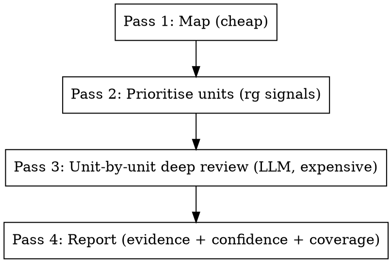

# C/C++ Bug Pattern Audit (Large Codebase)

## Core Philosophy: Trade Tokens for Quality

This skill performs **deep, LLM-driven semantic review of code, one unit at a time**, applying the full template checklist on each unit. It deliberately spends tokens to produce findings that survive scrutiny.

> **Pattern matching is a prior, not a verdict.** Grep / ripgrep tells you *where to look*; the LLM decides *whether there is a bug* by actually reading and understanding the code.

Concretely:

- **Do not** use detection queries as a filter that promotes matches into findings. They are a *prioritisation signal*: which units are most likely to harbour bugs.
- **Do** read each prioritised unit (function, method, or small file) end-to-end, including its callers / callees as needed, and apply *all* relevant templates as a mental checklist.
- **Do** trace data flow, ownership, lock-set, and thread affinity by reading code, not by string matching.
- **Do** spend tokens generously on ambiguous units. A `medium` finding promoted to `high` after deeper analysis is worth far more than a hundred shallow `medium`s.

If you find yourself producing findings without having read the function body and its context, you are doing it wrong.

## When to Use

- Auditing a C/C++ codebase (or subsystem) for known bug classes: memory safety, concurrency, resource management, integer/logic.
- Investigating a class of suspected issues (e.g. "we think there are deadlocks in the io subsystem").
- Reviewing a PR or directory before merge / release.
- Pre-fuzzing or pre-static-analysis manual sweep.

**Do NOT use** for:
- Single-file casual review (just read it).
- Style / formatting issues.
- Architectural critique.
- Languages other than C/C++ (the templates assume C/C++ semantics).

## The Iron Rule

> **No finding without verifiable evidence.**

Every reported finding MUST cite the lines that prove the bug and MUST list which false-positive filters from `references/false-positive-filters.md` were ruled out. A finding without a complete `required_evidence` block is invalid — drop it or downgrade to `low` (audit gaps).

## Four-Pass Workflow

Execute the four passes in order. Pass 3 is where the token spend lives.

Detailed instructions for each pass live in `references/methodology.md`. **You MUST read it before starting an audit.**

### Pass 1 — Map (cheap, structural)

Build a small, structured picture of the repo: top-level layout, build system, concurrency surface, ownership conventions, existing safety nets (sanitizers, static analyzers), in-scope vs out-of-scope.

Cheap and structural — no per-line LLM reading here.

### Pass 2 — Prioritise units (rg signals → ranked unit list)

The unit of audit is a **code unit**: a function, a class method, or a small file (~ ≤ 200 LoC). For large files, a unit is a function/method.

Use grep / ripgrep signals to **rank** units by suspicion, *not* to enumerate findings:

1. Run `scripts/scan_candidates.py --path <scope>` — produces JSONL of all template hits across the scope.
2. Run `scripts/list_units.py --candidates <jsonl> --path <scope>` — aggregates hits per unit and emits a **prioritised unit list** with a suspicion score.
3. The top-N units are reviewed in Pass 3 first; the long tail is reviewed when budget allows. Un-reviewed units are recorded as audit gaps.

Suspicion signals combined into the score:
- Number and severity of template hits inside the unit.
- Presence of concurrency primitives (mutex, atomic, condition variable).
- Presence of raw memory operations (`new`, `delete`, `malloc`, `memcpy`, etc.).
- Unit size (very small or very large units get a small bump — both can hide bugs).
- Recency: units in `git log --since=...` recent commits.

This produces the **unit work-list** for Pass 3.

### Pass 3 — Unit-by-unit deep review (the token spend)

For each unit on the work-list, in priority order:

1. **Read the unit fully.** The whole function / method body, not just the matched line. Read the surrounding class declaration if member state is involved.
2. **Read the necessary callers.** For functions whose preconditions matter (null pointers, lock-set, thread affinity), read at least the immediate callers (≤ 20 — if more, sample and note).
3. **Read the necessary callees.** For ownership transfer, lock acquisition inside helpers, etc., read the called function's relevant parts.
4. **Apply the template checklist.** For each applicable template (see `references/templates.md`), execute its `verification` checklist on this unit. *Apply all relevant templates in one read of the unit*, not one template at a time.
5. **Apply false-positive filters.** Read `references/false-positive-filters.md` and explicitly rule out applicable filters. Cite which filters you ruled out — even a clean unit gets a "no findings, ruled out X, Y, Z" coverage record.
6. **Record outcomes** with `scripts/coverage_tracker.py`:
   - For each finding: `mark --status confirmed --confidence high|medium --reason …`
   - For each ruled-out candidate: `mark --status suppressed --filter <fp.id> --reason …`
   - For each candidate that remains uncertain after bounded effort: `mark --status inconclusive --reason …` (counts as audit gap).

**Token discipline**:
- Spend generously to fully understand the unit. Do not hurry.
- "Bounded effort" applies *per uncertain question*, not per unit. Each uncertain sub-question gets ~10 minutes of follow-up reads; if still uncertain, downgrade that finding to `low` and continue. Do not abandon the unit.
- A unit that yields 0 findings after deep review is a *positive result* and must be recorded — that is how coverage is measured.

For concurrency units you MUST also build a **lock-set / thread-affinity sketch**. See `references/methodology.md#concurrency-deep-dive`.

### Pass 4 — Report

Use `references/reporting.md` for the exact format. Default report contains only `high` and `medium` confidence findings. `low` and `inconclusive` are listed separately as **audit gaps** so reviewers can decide whether to invest more time.

Always include:
- **Coverage summary**: units reviewed / total units in scope; per-template hit / suppression / inconclusive counts.
- **Audit gaps**: un-reviewed units (with rationale), inconclusive findings, out-of-scope paths.

## Template System

Templates in `references/templates.md` are the **per-unit checklist**. Each template has these fields:

| Field | Purpose |
|---|---|
| `id` | Stable identifier used in reports and coverage logs |
| `name` / `category` / `severity` | Triage / sorting |
| `detection_query` | `rg` invocation that produces the Pass 2 ranking signal. **Not** a finding gate. |
| `false_positive_filters` | Filters to actively rule out before promoting a finding |
| `verification` | The checklist the LLM MUST execute on each unit where the template might apply |
| `required_evidence` | Exact pieces of code / data flow that must be cited in the report |
| `confidence_rubric` | How to rate `high` / `medium` / `low` for this template |
| `bad_example` / `good_example` | Calibration examples |
| `fix_suggestions` | Recommended fixes |

**A finding is invalid if any `required_evidence` item is missing.** Do not paper over missing evidence with prose.

## Built-in Templates

See `references/templates.md` for the full text. Categories (extended from the original set):

| Category | Templates |
|---|---|
| Memory safety | `mem-leak-new-no-delete`, `mem-array-new-mismatched-delete`, `mem-double-free`, `mem-use-after-free`, `mem-uninitialized-read`, `mem-rule-of-three-five`, `mem-buffer-overflow-index`, `mem-strncpy-no-terminator` |
| Null / optional | `ptr-deref-no-check`, `ptr-this-may-be-null-callback`, `ptr-optional-value-no-check`, `ptr-iterator-invalidated` |
| Resource | `res-file-no-close`, `res-mutex-no-unlock`, `res-fd-leak-on-error`, `res-raii-broken-by-release` |
| Concurrency | `con-unsynchronized-shared-write`, `con-lock-ordering-deadlock`, `con-double-checked-locking`, `con-sleep-or-blocking-with-lock-held`, `con-callback-invoked-with-lock-held`, `con-missing-memory-order`, `con-tocttou`, `con-condvar-no-predicate` |
| Logic | `int-add-overflow`, `int-sub-underflow`, `int-mul-overflow-alloc-size`, `int-shift-out-of-range`, `int-signed-unsigned-mix`, `int-narrowing-cast`, `div-by-zero`, `empty-container-front-back` |

Templates focused on the user's stated priorities (concurrency / locking / memory safety) carry the deepest verification contracts.

## Scripts

| Script | Purpose |
|---|---|
| `scripts/scan_candidates.py` | Run all template `detection_query` patterns and emit JSONL of candidates. Pass 2 prioritisation input. Supports `--template ID`, `--path SUBDIR`, `--out FILE`, `--list`, `--dry-run`. |
| `scripts/list_units.py` | Aggregate candidates per code unit (function / file) and emit a prioritised unit work-list with suspicion scores. Pass 2 output → Pass 3 input. |
| `scripts/coverage_tracker.py` | Track per-candidate and per-unit verification outcomes (`confirmed` / `suppressed` / `inconclusive`) with reasons. Drives the coverage table in Pass 4. |
| `scripts/excel_helper.py` | Render the final report (with confidence + evidence columns) to Excel; separate sheet for audit gaps. |

All scripts are runnable standalone with `--help`.

## Cross-Reference Files

| File | Read when |
|---|---|
| `references/methodology.md` | Always, before Pass 1. |
| `references/templates.md` | Pass 2 (ranking signals) and Pass 3 (per-unit checklist). |
| `references/false-positive-filters.md` | Pass 3 (mandatory FP check). |
| `references/reporting.md` | Pass 4. |

## Common Mistakes (and how this skill prevents them)

| Mistake | Prevention |
|---|---|
| Treating every grep hit as a candidate finding | SKILL.md core philosophy + Pass 2 produces *unit ranking*, not findings. |
| Verifying one template at a time on the same unit (re-reading it 30×) | Pass 3 step 4: apply *all* relevant templates in one read of the unit. |
| Reporting unsynchronized access without checking thread affinity | Concurrency Deep Dive in `methodology.md` — required lock-set + thread-affinity sketch. |
| Reporting `new` without `delete` when the object is owned by a smart pointer / sink / container destructor | `references/false-positive-filters.md` enumerates ownership-transfer filters; Pass 3 must rule them out. |
| Reporting null deref when callers all establish non-null | `fp.null.proven-non-null` filter; Pass 3 requires caller audit (≤ 20 callers, else mark `inconclusive`). |
| Skipping units because "the regex didn't match anything in there" | A 0-hit unit can still be reviewed if its file shows up in Pass 1 concurrency surface or memory ownership conventions. |
| Stopping the audit when budget is exhausted, leaving silent un-reviewed units | Coverage tracker explicitly lists un-reviewed units as audit gaps. |

## Red Flags — Stop and Re-read the Methodology

- You're about to write a finding without a `required_evidence` block.
- You can't name the FP filter that you ruled out for a borderline case.
- You verified a candidate without reading the surrounding function body.
- You marked something `high` confidence without a data-flow / lock-set / thread-affinity trace.
- Your report contains > 30% `medium` and < 5% `high` — usually means verification was too shallow.
- You "saved tokens" by skipping the per-unit deep read. The whole point of this skill is to spend tokens on quality.

If any red flag fires, re-read `references/methodology.md` and redo Pass 3 for the affected unit.
