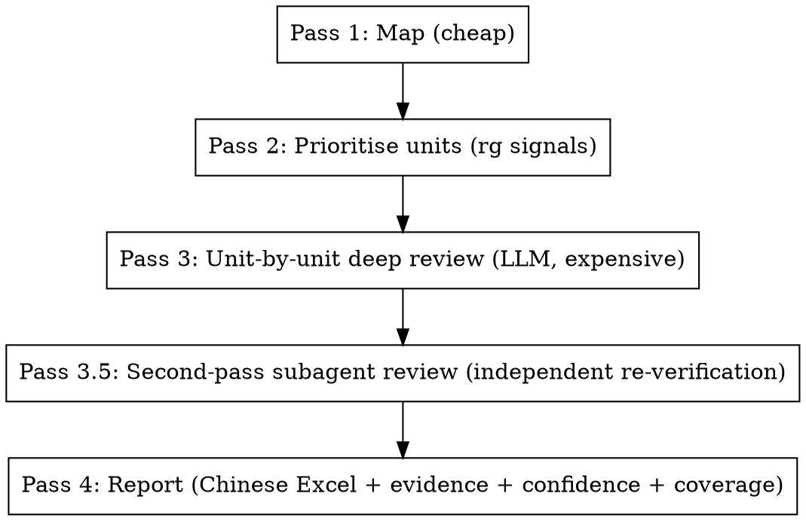

# C/C++ Bug Pattern Audit (Large Codebase)

## Core Philosophy: Trade Tokens for Quality

This skill performs **deep, LLM-driven semantic review of code, one unit at a time**, applying the full template checklist on each unit. It deliberately spends tokens to produce findings that survive scrutiny.

> **Pattern matching is a prior, not a verdict.** Grep / ripgrep tells you *where to look*; the LLM decides *whether there is a bug* by actually reading and understanding the code.

Concretely:

- **Do not** use detection queries as a filter that promotes matches into findings. They are a *prioritisation signal*: which units are most likely to harbour bugs.
- **Do** read each prioritised unit (function, method, or small file) end-to-end, including its callers / callees as needed, and apply *all* relevant templates as a mental checklist.
- **Do** trace data flow, ownership, lock-set, and thread affinity by reading code, not by string matching.
- **Do** spend tokens generously on ambiguous units. A `medium` finding promoted to `high` after deeper analysis is worth far more than a hundred shallow `medium`s.

If you find yourself producing findings without having read the function body and its context, you are doing it wrong.

## When to Use

- Auditing a C/C++ codebase (or subsystem) for known bug classes: memory safety, concurrency, resource management, integer/logic.
- Investigating a class of suspected issues (e.g. "we think there are deadlocks in the io subsystem").
- Reviewing a PR or directory before merge / release.
- Pre-fuzzing or pre-static-analysis manual sweep.

**Do NOT use** for:
- Single-file casual review (just read it).
- Style / formatting issues.
- Architectural critique.
- Languages other than C/C++ (the templates assume C/C++ semantics).

## The Iron Rule

> **No finding without verifiable evidence.**

Every reported finding MUST cite the lines that prove the bug and MUST list which false-positive filters from `references/false-positive-filters.md` were ruled out. A finding without a complete `required_evidence` block is invalid — drop it or downgrade to `low` (audit gaps).

## Five-Pass Workflow

Execute the passes in order. Pass 3 is where the LLM-driven analysis lives. Pass 3.5 is an independent re-verification by a subagent that catches hallucinations and missed FP filters.



Detailed instructions for each pass live in `references/methodology.md`. **You MUST read it before starting an audit.**

### Pass 1 — Map (cheap, structural)

Build a small, structured picture of the repo: top-level layout, build system, concurrency surface, ownership conventions, existing safety nets (sanitizers, static analyzers), in-scope vs out-of-scope.

**Pass 1 also picks the specialty template file(s).** Read `references/templates.md` (the specialty index — small and cheap) and use its decision tree to choose one of:
- `templates/memory-safety.md` (heap / stack / buffer / pointer / DMA)
- `templates/concurrency-and-isr.md` (races / lock ordering / ISR / RTOS sync)
- `templates/resource-management.md` (RAII / fd / peripheral lifecycle)
- `templates/logic-and-numeric.md` (integer / portability / endianness)
- `templates/embedded-hardware.md` (watchdog / low-power / MMIO RMW / flash)

Loading multiple specialty files is acceptable but should be deliberate; loading all 5 is rare ("comprehensive audit"). Cheap and structural — no per-line LLM reading here.

### Pass 2 — Prioritise units (rg signals → ranked unit list)

The unit of audit is a **code unit**: a function, a class method, or a small file (~ ≤ 200 LoC). For large files, a unit is a function/method.

Use grep / ripgrep signals to **rank** units by suspicion, *not* to enumerate findings:

1. Run `scripts/scan_candidates.py --path <scope>` — produces JSONL of all template hits across the scope.
2. Run `scripts/list_units.py --candidates <jsonl> --path <scope>` — aggregates hits per unit and emits a **prioritised unit list** with a suspicion score.
3. The top-N units are reviewed in Pass 3 first; the long tail is reviewed when budget allows. Un-reviewed units are recorded as audit gaps.

Suspicion signals combined into the score:
- Number and severity of template hits inside the unit.
- Presence of concurrency primitives (mutex, atomic, condition variable).
- Presence of raw memory operations (`new`, `delete`, `malloc`, `memcpy`, etc.).
- Unit size (very small or very large units get a small bump — both can hide bugs).
- Recency: units in `git log --since=...` recent commits.

This produces the **unit work-list** for Pass 3.

### Pass 3 — Unit-by-unit deep review (the token spend)

For each unit on the work-list, in priority order:

1. **Read the unit fully.** The whole function / method body, not just the matched line. Read the surrounding class declaration if member state is involved.
2. **Read the necessary callers.** For functions whose preconditions matter (null pointers, lock-set, thread affinity), read at least the immediate callers (≤ 20 — if more, sample and note).
3. **Read the necessary callees.** For ownership transfer, lock acquisition inside helpers, etc., read the called function's relevant parts.
4. **Apply the template checklist.** For each applicable template (see `references/templates.md`), execute its `verification` checklist on this unit. *Apply all relevant templates in one read of the unit*, not one template at a time.
5. **Apply false-positive filters.** Read `references/false-positive-filters.md` and explicitly rule out applicable filters. Cite which filters you ruled out — even a clean unit gets a "no findings, ruled out X, Y, Z" coverage record.
6. **Record outcomes** with `scripts/coverage_tracker.py`:
   - For each finding: `mark --status confirmed --confidence high|medium --reason …`
   - For each ruled-out candidate: `mark --status suppressed --filter <fp.id> --reason …`
   - For each candidate that remains uncertain after bounded effort: `mark --status inconclusive --reason …` (counts as audit gap).

**Token discipline**:
- Spend generously to fully understand the unit. Do not hurry.
- "Bounded effort" applies *per uncertain question*, not per unit. Each uncertain sub-question gets ~10 minutes of follow-up reads; if still uncertain, downgrade that finding to `low` and continue. Do not abandon the unit.
- A unit that yields 0 findings after deep review is a *positive result* and must be recorded — that is how coverage is measured.

For concurrency units you MUST also build a **lock-set / thread-affinity sketch**. See `references/methodology.md#concurrency-deep-dive`.

### Pass 3.5 — Second-pass subagent review (independent re-verification)

After Pass 3 produces findings, dispatch an **independent subagent** that does NOT see the auditor's reasoning chain. The subagent is given only the structured finding (template, location, summary, evidence, FP filters claimed) plus read access to the codebase, and is asked to re-derive a verdict by reading the source.

Why: a single agent reasoning about its own findings has a strong bias toward confirming them. An independent reader catches hallucinated line numbers, falsely-claimed FP filters, missed `fp.test-code` / `fp.generated-code`, and over-reaching severity. The verdict (`agree` / `disagree` / `uncertain`) and rationale are merged into each finding and surfaced in the Excel as `子代理复核结论` + `子代理复核依据`.

**This pass is mandatory.** Skip it only if the user explicitly asks for "no second pass" (e.g. exploratory dry runs).

Procedure (full prompt template and verdict schema in `references/second-pass-review.md`):

1. Group findings into batches (~5–10 each); group by file or directory when possible to share file reads.
2. For each batch, dispatch the `Task` tool with `subagent_type="explore"` (preferred — read-only) or `"generalPurpose"` with `readonly=true`. Pass the prompt template from `references/second-pass-review.md` with the batch's findings JSON inlined.
3. Each subagent returns a JSON array of verdicts (one per finding). Save them to `audit/verdicts-batchN.jsonl`.
4. Concatenate all verdict files and merge into the findings:
   ```bash
   scripts/merge_second_pass.py \
       --findings findings.json \
       --verdicts verdicts.jsonl \
       --out findings_with_review.json
   ```
   Findings that did not get a verdict (subagent timeout, malformed JSON) are tagged `verdict: "missing"` so the gap is visible to humans.
5. The merged JSON is the input to `excel_helper.py` in Pass 4.

The subagent's verdict is **advisory**, not authoritative — it informs the human reviewer but does not auto-suppress or auto-promote findings. The 人工确认 column is still the final word.

### Pass 4 — Report

Use `references/reporting.md` for the exact format. Default report contains only `high` and `medium` confidence findings. `low` and `inconclusive` are listed separately as **audit gaps** so reviewers can decide whether to invest more time.

Always include:
- **Coverage summary**: units reviewed / total units in scope; per-template hit / suppression / inconclusive counts.
- **Audit gaps**: un-reviewed units (with rationale), inconclusive findings, out-of-scope paths.

## Template System

Templates in `references/templates.md` are the **per-unit checklist**. Each template has these fields:

| Field | Purpose |
|---|---|
| `id` | Stable identifier used in reports and coverage logs |
| `name` / `category` / `severity` | Triage / sorting |
| `detection_query` | `rg` invocation that produces the Pass 2 ranking signal. **Not** a finding gate. |
| `false_positive_filters` | Filters to actively rule out before promoting a finding |
| `verification` | The checklist the LLM MUST execute on each unit where the template might apply |
| `required_evidence` | Exact pieces of code / data flow that must be cited in the report |
| `confidence_rubric` | How to rate `high` / `medium` / `low` for this template |
| `bad_example` / `good_example` | Calibration examples |
| `fix_suggestions` | Recommended fixes |

**A finding is invalid if any `required_evidence` item is missing.** Do not paper over missing evidence with prose.

## Built-in Templates — Specialty Files (C/C++ embedded)

Templates are split into **5 specialty files** to keep context small. Pass 1 chooses one (or more) specialty file based on the audit scope; the index `references/templates.md` is the only template-related file the agent reads unconditionally.

| Specialty file | Load when audit scope is | # templates |
|---|---|---|
| `references/templates/memory-safety.md` | heap / stack / object lifetime / buffer / pointer / DMA buffer | 16 |
| `references/templates/concurrency-and-isr.md` | data races / lock ordering / memory ordering / ISR / RTOS sync | 14 |
| `references/templates/resource-management.md` | RAII / fd / mutex / peripheral clock / RTOS task / HW timer / NVIC | 8 |
| `references/templates/logic-and-numeric.md` | integer overflow / signedness / shift / division / endianness / packed struct | 13 |
| `references/templates/embedded-hardware.md` | watchdog / low-power / MMIO RMW / flash-write / IRQ-disabled critical sections | 6 |

Total: **57 templates**, all C/C++-embedded-flavoured. Token economics: index (~6 KB) + 1 specialty file (~10–14 KB) ≈ 16–20 KB per audit, vs ~50 KB for loading the full catalogue.

Template id prefixes (for quick identification): `mem-*`, `ptr-*`, `res-*`, `con-*`, `int-*`, `isr-*`, `rtos-*`, `emb-*`.

See `references/templates.md` for the full per-specialty index, the decision tree, and the per-template-contract field definitions. The specialty files contain the actual detection contracts (`detection_query`, `false_positive_filters`, `verification`, `required_evidence`, `confidence_rubric`, `bad_example`, `good_example`, `fix_suggestions`).

## Scripts

| Script | Purpose |
|---|---|
| `scripts/scan_candidates.py` | Run all template `detection_query` patterns and emit JSONL of candidates. Pass 2 prioritisation input. Supports `--template ID`, `--path SUBDIR`, `--out FILE`, `--list`, `--dry-run`. |
| `scripts/list_units.py` | Aggregate candidates per code unit (function / file) and emit a prioritised unit work-list with suspicion scores. Pass 2 output → Pass 3 input. |
| `scripts/coverage_tracker.py` | Track per-candidate and per-unit verification outcomes (`confirmed` / `suppressed` / `inconclusive`) with reasons. Drives the coverage table in Pass 4. |
| `scripts/merge_second_pass.py` | Merge a JSONL of subagent verdicts (from Pass 3.5) into the findings JSON, producing `findings_with_review.json` that carries a `second_pass_review` block per finding. |
| `scripts/excel_helper.py` | Render the final report into a Chinese, human-review-friendly `.xlsx` (4 sheets: 审查总览 / 发现明细 / 审计盲区 / 覆盖率明细) with severity colour coding, frozen header, autofilter, separate `文件` + `行号` columns (for `git blame` / 责任人 lookup), `子代理复核结论` (color-coded) + `子代理复核依据` columns from Pass 3.5, and a `人工确认` dropdown column for per-finding sign-off. Accepts `--coverage`, `--repo`, `--scope`, `--reviewer` for the overview sheet. |

All scripts are runnable standalone with `--help`.

## Cross-Reference Files

| File | Read when |
|---|---|
| `references/methodology.md` | Always, before Pass 1. |
| `references/templates.md` | Pass 1 — read the specialty index + decision tree to pick which specialty file(s) to load. |
| `references/templates/<specialty>.md` | Pass 2 (ranking signals) and Pass 3 (per-unit checklist). Load only the specialty file(s) chosen in Pass 1. |
| `references/false-positive-filters.md` | Pass 3 (mandatory FP check). |
| `references/second-pass-review.md` | Pass 3.5 (subagent prompt template + verdict schema). |
| `references/reporting.md` | Pass 4. |

## Common Mistakes (and how this skill prevents them)

| Mistake | Prevention |
|---|---|
| Treating every grep hit as a candidate finding | SKILL.md core philosophy + Pass 2 produces *unit ranking*, not findings. |
| Verifying one template at a time on the same unit (re-reading it 30×) | Pass 3 step 4: apply *all* relevant templates in one read of the unit. |
| Reporting unsynchronized access without checking thread affinity | Concurrency Deep Dive in `methodology.md` — required lock-set + thread-affinity sketch. |
| Reporting `new` without `delete` when the object is owned by a smart pointer / sink / container destructor | `references/false-positive-filters.md` enumerates ownership-transfer filters; Pass 3 must rule them out. |
| Reporting null deref when callers all establish non-null | `fp.null.proven-non-null` filter; Pass 3 requires caller audit (≤ 20 callers, else mark `inconclusive`). |
| Skipping units because "the regex didn't match anything in there" | A 0-hit unit can still be reviewed if its file shows up in Pass 1 concurrency surface or memory ownership conventions. |
| Stopping the audit when budget is exhausted, leaving silent un-reviewed units | Coverage tracker explicitly lists un-reviewed units as audit gaps. |

## Red Flags — Stop and Re-read the Methodology

- You're about to write a finding without a `required_evidence` block.
- You can't name the FP filter that you ruled out for a borderline case.
- You verified a candidate without reading the surrounding function body.
- You marked something `high` confidence without a data-flow / lock-set / thread-affinity trace.
- Your report contains > 30% `medium` and < 5% `high` — usually means verification was too shallow.
- You "saved tokens" by skipping the per-unit deep read. The whole point of this skill is to spend tokens on quality.

If any red flag fires, re-read `references/methodology.md` and redo Pass 3 for the affected unit.
