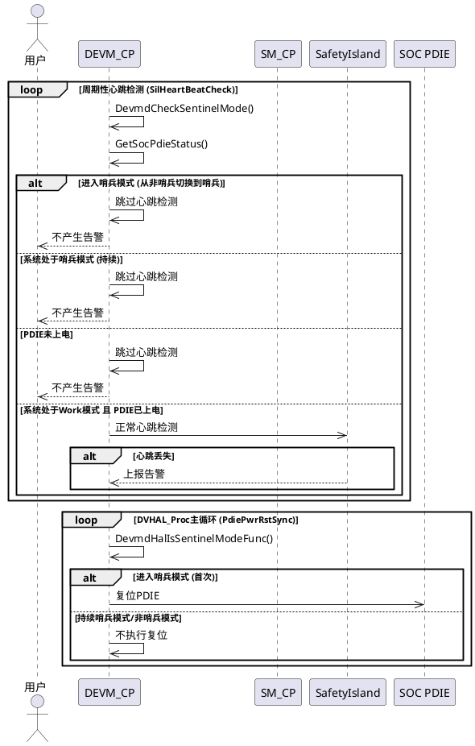
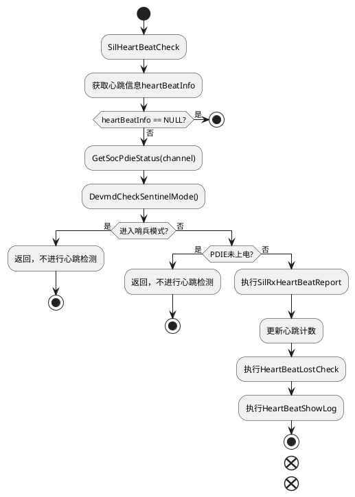
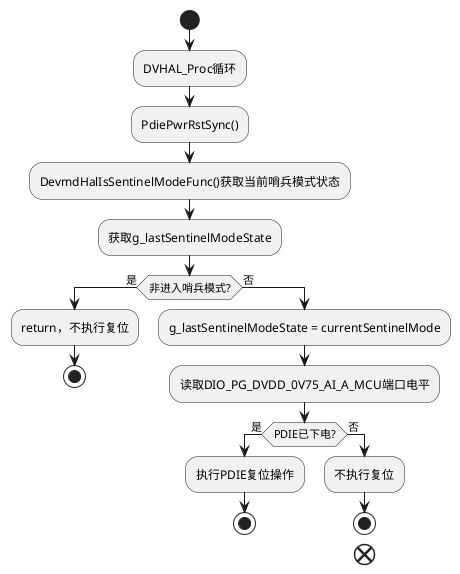

# 1 AR概述（必要）

| 组件名称 | 命名（软件模块/组件/CBB/服务等） |
| --- | --- |
| AR系统流水号 | AR20251013933991 |
| AR描述 |
【需求描述】

1、1952系列单板，进入哨兵模式后，海思会将SafetyIsland也一起下电，实现SOC降功耗目的；

2、进入哨兵模式时，根据SM_CP透传的SS_AP高4bit业务状态信息，如果系统处于哨兵模式，则停止与SOC的SafetyIsland心跳检测，避免产生不必要的告警；

3、进入哨兵模式时，需要复位SOC的PDIE，确保SOC相关硬件进入正确状态；

4、退出哨兵模式时，系统进入Work状态后，需要恢复该告警检测。
|

# 2 动态行为（必要）

## 2.1 交互时序图

### （1）哨兵模式SafetyIsland心跳控制时序图

# 3 功能点分解（必要）

| **序号** | **功能点名称** | **功能点描述** |
| --- | --- | --- |
| 1 | 哨兵模式状态检测 | 通过SM_CP透传的SS_AP高4bit业务状态信息，判断系统是否处于哨兵模式 |
| 2 | 哨兵模式心跳控制 | 进入哨兵模式时停止SafetyIsland心跳检测，退出哨兵模式时恢复心跳检测 |
| 3 | 心跳告警抑制 | 在哨兵模式下避免产生不必要的SafetyIsland心跳丢失告警 |
| 4 | 哨兵模式PDIE复位 | 进入哨兵模式时复位SOC的PDIE，确保SOC相关硬件进入正确状态 |
| 5 | PDIE状态检测 | 在心跳检测前检查PDIE电源状态，只有PDIE上电时才进行心跳检测 |

# 4 实现设计（必要）

## 4.1 功能实现思路 （必要）

### 4.1.1 哨兵模式状态检测实现

通过`DevmdCheckSentinelMode`函数实现哨兵模式状态检测：

- 首先判断是否为MDC630设备（只有MDC630是1952芯片）
- 通过`Rte_Read_SmAppPlatInfo_Info`接口读取SM_CP透传的SS_AP高4bit业务状态信息
- 当`param0 == 5`（ENTER_SENTINEL_MODE）时，表示系统处于哨兵模式
- 该函数通过HAL层回调机制注册到devm_hal模块中

### 4.1.2 心跳检测控制实现

在`SilHeartBeatCheck`函数入口处增加哨兵模式和PDIE状态判断：

- 调用`DevmdCheckSentinelMode`检测当前是否处于哨兵模式
- 调用`GetSocPdieStatus`获取PDIE电源状态
- 只有同时满足以下两个条件时才执行心跳检测：
  - 不处于哨兵模式 (`DevmdCheckSentinelMode() == FALSE`)
  - 对应PDIE已上电 (`pDieStatus == PDIE_VALID`)
- 如果处于哨兵模式或PDIE未上电，直接返回，不进行心跳检测和告警上报
- 退出哨兵模式或PDIE上电后，自动恢复心跳检测(已有逻辑检测是否处于working态)

### 4.1.3 哨兵模式PDIE复位实现

在检测到进入哨兵模式时，复位SOC的PDIE：

- 使用静态变量`g_lastSentinelModeState`记录上一次的哨兵模式状态
- 在`DVHAL_Proc`循环中调用`PdiePwrRstSync()`函数检测是否需要复位PDIE
- 当检测到从非哨兵模式进入哨兵模式时（`currentSentinelMode == TRUE && g_lastSentinelModeState == FALSE`），执行PDIE复位操作
- `PdiePwrRstSync`函数会检测PDIE电源状态，如果PDIE已下电（`DIO_PG_DVDD_0V75_AI_A_MCU`为0），则执行PDIE复位操作
- 只有在进入哨兵模式的时刻才会执行一次PDIE复位，避免重复复位

## 4.2 功能实现设计（必要）

### 4.2.1 流程图

### 4.2.2 PDIE复位流程图

### 4.2.3 流程说明

1. **SilHeartBeatCheck**：SafetyIsland心跳检测主函数
2. **DevmdCheckSentinelMode**：判断当前是否处于哨兵模式
3. **SilRxHeartBeatReport**：上报心跳信息（正常模式下执行）
4. **HeartBeatLostCheck**：心跳丢失检测
5. **HeartBeatShowLog**：心跳日志显示
6. **DVHAL_Proc**：设备管理主循环，周期性调用PdiePwrRstSync
7. **PdiePwrRstSync**：检测并复位SOC的PDIE（仅在进入哨兵模式时执行一次）
8. **DevmdHalIsSentinelModeFunc**：HAL层回调函数，获取当前哨兵模式状态

### 4.2.4 新增/修改的关键变量

| 变量名 | 类型 | 说明 |
| --- | --- | --- |
| `ENTER_SENTINEL_MODE` | uint8 | 哨兵模式标识常量，值为5 |
| `PDIE_VALID` | uint8 | PDIE上电状态常量，值为1 |
| `PDIE_INVALID` | uint8 | PDIE下电状态常量，值为0 |
| `PDIE_TBL[]` | uint32数组 | PDIE端口列表，包含DIO_PG_DVDD_0V75_AI_A_MCU和DIO_PG_DVDD_0V75_AI_B_MCU |
| `g_lastSentinelModeState` | boolean | 记录上一次的哨兵模式状态，用于检测进入哨兵模式时刻（cpldless_power_opr.c） |
| `DevmdCheckSentinelMode` | function | 新增函数，用于检测哨兵模式状态（devmd_srv_cp.c） |
| `PdiePwrRstSync` | function | 用于检测并复位SOC的PDIE（cpldless_power_opr.c） |
| `DevmdHalIsSentinelModeFunc` | function | HAL层回调函数，获取哨兵模式状态（devmd_hal_base.c） |
| `DefIsSentinelModeFunc` | function | 默认的哨兵模式检测函数，未注册时使用（devmd_hal_base.c） |
| `GetSocPdieStatus` | function | 新增函数，用于获取SOC的PDIE状态（sil_heart_beat.c） |

### 4.2.5 接口描述（必要）

|接口名|参数名|参数类型|参数描述|
| --- | --- | --- | --- |
|`DevmdCheckSentinelMode`|无|boolean|检测当前是否处于哨兵模式，返回TRUE表示处于哨兵模式|
|`PdiePwrRstSync`|无|void|检测并复位SOC的PDIE，仅在进入哨兵模式时执行一次|
|`SilHeartBeatCheck`|channel|uint8|心跳检测通道号|
|`SilHeartBeatCheck`|heartBeatInfo|SilRxHeartBeatInfo*|心跳信息结构体指针|
|`DevmdHalIsSentinelModeFunc`|无|DevmdIsSentinelModeFunc|HAL层回调，获取当前哨兵模式状态|
|`DevmdHalRegisterFuncSet`|funcSet|DevmdCpldCallBackFuncSet*|注册回调函数集，包含isSentinelMode回调|
|`GetSocPdieStatus`|channel|uint8|获取指定通道的PDIE状态，返回PDIE_VALID(1)表示上电，PDIE_INVALID(0)表示下电|

## 4.3 代码设计（必要）

### 4.3.1 新增DevmdCheckSentinelMode函数

在`devmd_srv_cp.c`中新增`DevmdCheckSentinelMode`函数，实现：

- 判断设备是否为MDC630（调用`DevmdBoardIsMdc630`）
- 通过Rte接口`Rte_Read_SmAppPlatInfo_Info`获取SM_CP透传的平台信息
- 判断param0是否等于ENTER_SENTINEL_MODE(5)
- 该函数通过回调注册机制注册到HAL层

### 4.3.2 修改SilHeartBeatCheck函数

在`sil_heart_beat.c`的`SilHeartBeatCheck`函数中增加：

- 新增常量定义：`PDIE_VALID` (1) 和 `PDIE_INVALID` (0)
- 新增PDIE端口数组`PDIE_TBL[]`，包含两个PDIE电源检测端口
- 新增`GetSocPdieStatus`函数，用于获取指定通道的PDIE电源状态
- 函数入口处增加参数校验（channel >= SAFETYISLAND_CHANNEL_MAX）
- 调用`GetSocPdieStatus`获取当前PDIE状态
- 调用`DevmdCheckSentinelMode`获取当前哨兵模式状态
- 只有同时满足不在哨兵模式且PDIE已上电两个条件时，才执行心跳检测
- 如果处于哨兵模式或PDIE未上电，直接返回，不执行后续心跳检测和告警上报
- 退出哨兵模式或PDIE上电后，自动恢复心跳检测功能

### 4.3.3 新增HAL层回调支持

在`devmd_hal.h`、`devmd_hal_base.h`、`devmd_hal_base.c`中新增：

- 新增`DevmdIsSentinelModeFunc`回调函数类型
- 在`DevmdCpldCallBackFuncSet`结构体中新增`isSentinelMode`字段
- 实现`DevmdHalIsSentinelModeFunc`函数用于获取回调
- 实现`DefIsSentinelModeFunc`默认函数，未注册时返回FALSE并打印日志

### 4.3.4 新增PdiePwrRstSync调用

在`cpldless_power_opr.c`中：

- 新增静态变量`g_lastSentinelModeState`记录上次哨兵模式状态
- 修改`PdiePwrRstSync`函数，添加哨兵模式判断逻辑：
  - 调用`DevmdHalIsSentinelModeFunc()`获取当前哨兵模式状态
  - 如果当前不是进入哨兵模式的状态（或上次已是哨兵模式），直接返回
  - 更新`g_lastSentinelModeState`记录当前状态
  - 只有在进入哨兵模式时刻才执行PDIE复位操作

在`cpldless_srv.c`的`DVHAL_Proc`函数中：

- 增加对`PdiePwrRstSync()`函数的调用，实现周期性检测

### 4.3.5 注册回调函数

在`devmd_srv_cp.c`的初始化函数中：

- 在`g_devmdCpldCallBackFuncSet`结构体中注册`DevmdCheckSentinelMode`到`isSentinelMode`字段

# 5 MDC场景设计（必要）

## 5.1 并发场景分析

| 分析项 | 内容 |
| --- | --- |
| 是否涉及并发 | 是 |
| 并发场景描述 | 多通道SOC（channel A/B）同时进行心跳检测和哨兵模式判断，各通道独立处理，无锁竞争 |
| 线程保护机制 | 各通道独立的状态变量 `g_lastSentinelModeState`，不涉及跨线程共享状态 |

## 5.2 启动退出分析

| 分析项 | 内容 |
| --- | --- |
| 是否涉及启动/退出 | 是 |
| 影响评估 | DEVM_CP模块初始化时注册哨兵模式检测回调，进程退出时自动释放资源，无特殊处理需求 |

## 5.3 休眠唤醒分析

| 分析项 | 内容 |
| --- | --- |
| 是否涉及休眠唤醒 | 是 |
| 处理策略 | 系统从哨兵模式退出进入Work状态后，DVHAL_Proc循环自动恢复心跳检测功能，无需额外唤醒处理 |

## 5.4 可靠性分析

| 分析项 | 内容 |
| --- | --- |
| 可靠性要求 | 1. 哨兵模式状态判断必须准确，避免误判导致告警丢失 2. PDIE复位只在进入哨兵模式时执行一次，避免重复复位 3. PDIE状态读取失败时默认按未上电处理，保证安全性 |
| 可靠性措施 | 1. 使用Rte接口获取SM_CP透传状态信息，可靠性依赖Rte通道 2. 状态机设计：使用 `g_lastSentinelModeState` 记录上一次状态，确保只在状态切换时刻执行PDIE复位 3. 异常处理：所有HAL调用均有默认值保护 |

## 5.5 进程SELinux权限分析

| 分析项 | 内容 |
| --- | --- |
| 需要权限 | 读Rte接口权限、读写GPIO/DIO权限 |
| 文件路径 | 无 |
| IPC路径 | Rte接口 `Rte_Read_SmAppPlatInfo_Info` |

---

# 6 重构设计（可选）

不涉及

# 7 测试设计（必要）

## 6.1 单元测试（UT）

| 序号 | 测试场景 | 预期结果 |
| --- | --- | --- |
| 1 | 非MDC630设备 | DevmdCheckSentinelMode返回FALSE |
| 2 | MDC630设备，非哨兵模式 | DevmdCheckSentinelMode返回FALSE，执行正常心跳检测 |
| 3 | MDC630设备，哨兵模式(param0=5) | DevmdCheckSentinelMode返回TRUE，跳过心跳检测 |
| 4 | 退出哨兵模式进入Work模式 | 恢复心跳检测功能 |
| 5 | 进入哨兵模式时 | PdiePwrRstSync()执行PDIE复位 |
| 6 | 连续处于哨兵模式 | 不重复执行PDIE复位 |
| 7 | HAL回调未注册 | DefIsSentinelModeFunc返回FALSE，不影响正常流程 |
| 8 | 从非哨兵模式切换到哨兵模式 | g_lastSentinelModeState状态正确转换 |
| 9 | PDIE未上电（channel A） | 跳过心跳检测，不产生告警 |
| 10 | PDIE未上电（channel B） | 跳过心跳检测，不产生告警 |
| 11 | PDIE已上电且非哨兵模式 | 执行正常心跳检测 |
| 12 | 哨兵模式+PDIE未上电 | 跳过心跳检测 |
| 13 | channel参数非法 | 直接返回，不进行检测 |

## 6.2 接口测试

| 接口名 | 测试场景 | 预期结果 |
| --- | --- | --- |
| DevmdCheckSentinelMode | param0=5 | 返回TRUE |
| DevmdCheckSentinelMode | param0=0 | 返回FALSE |
| DevmdCheckSentinelMode | 非MDC630设备 | 返回FALSE |
| DevmdHalIsSentinelModeFunc | 回调已注册 | 返回注册的函数指针 |
| DevmdHalIsSentinelModeFunc | 回调未注册 | 返回DefIsSentinelModeFunc |
| PdiePwrRstSync | 首次进入哨兵模式 | 执行PDIE复位 |
| PdiePwrRstSync | 非首次进入哨兵模式 | 直接返回，不执行复位 |
| PdiePwrRstSync | 非哨兵模式 | 直接返回 |
| GetSocPdieStatus | PDIE上电 | 返回PDIE_VALID(1) |
| GetSocPdieStatus | PDIE下电 | 返回PDIE_INVALID(0) |
| GetSocPdieStatus | channel=0 | 返回channel A的PDIE状态 |
| GetSocPdieStatus | channel=1 | 返回channel B的PDIE状态 |

## 6.3 异常场景测试

| 场景 | 预期行为 |
| --- | --- |
| Rte接口返回失败 | DevmdCheckSentinelMode返回FALSE，执行正常心跳检测 |
| heartBeatInfo为NULL | 直接返回，不进行检测 |
| HAL层回调未注册 | 使用默认函数，返回FALSE，记录日志 |
| PDIE电源已开启 | 不执行PDIE复位操作 |
| channel参数超出范围 | 直接返回，不进行检测 |
| PDIE状态读取失败 | 默认按PDIE下电处理，跳过心跳检测 |

# 7 软件成本项设计评估（ASPICE要求）

| 编号 | 软件成本项 | 预估消耗变化（上限预估） | 说明   |
| ---- | ---------- | ----------------------- | -------|
| 1    | CPU        | 增加约0.12%            | 每次心跳检测时增加一次哨兵模式判断和PDIE状态读取；DVHAL_Proc循环中增加PDIE复位检测 |
| 2    | MEMORY     | 增加约16字节            | 新增g_lastSentinelModeState静态变量（4字节）；新增回调函数指针（4字节）；新增PDIE_TBL数组（8字节） |
| 3    | RAM/Disk   | 无变化                   |       |
| 4    | AI Core    | 无变化                   |       |

# 8 修订记录

| 日期Date | 修订版本Version | 描述Description | 作者Prepared by |
| --- | --- | --- | --- |
| 2026-03-19 | V1.0 | 初稿 | l00007824 |
| 2026-03-23 | V1.1 | 增加进入哨兵模式时复位SOC的PDIE功能 | l00007824 |
| 2026-03-23 | V1.2 | 优化实现方案：新增HAL层回调机制，分离哨兵模式检测与心跳控制逻辑，在DVHAL_Proc中周期性检测PDIE复位条件 | l00007824 |
| 2026-03-24 | V1.3 | 增加PDIE状态检测逻辑：心跳检测需同时满足不在哨兵模式且PDIE已上电两个条件；增加GetSocPdieStatus函数获取PDIE电源状态 | l00007824 |
| 2026-03-30 | V1.4 | 优化进入/退出哨兵模式时的心跳检测控制逻辑：根据SM_CP透传的SS_AP高4bit业务状态信息判断系统状态，进入哨兵模式时停止SafetyIsland心跳检测避免产生不必要告警，退出哨兵模式进入Work状态后恢复心跳检测 | l00007824 |
| 2026-03-31 | V1.5 | 补充MDC场景设计章节，完善测试设计 | l00007824 |
