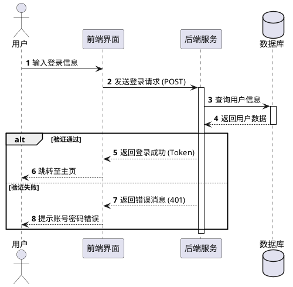
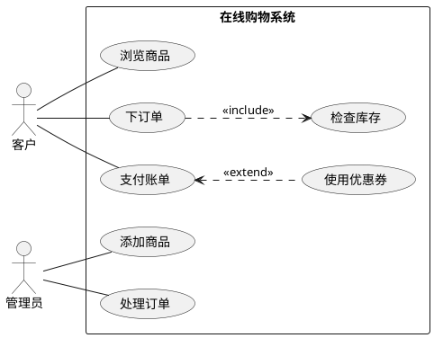
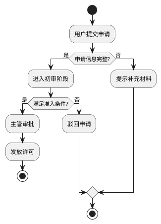
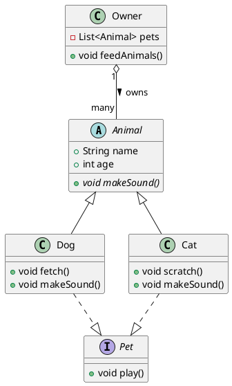
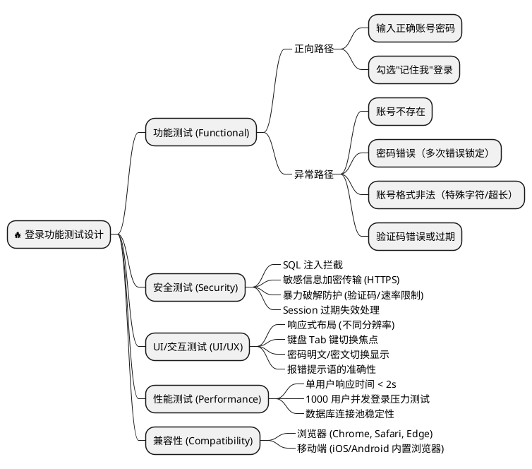

# AR实现设计说明书 

> **AI提示**: 该一级标题替换为文件名

>**AI提示** **简介**：本AR设计模板用于承载软件实现设计阶段流程规范要求，将项目在AR实现设计过程中对需求的功能点分析、实现设计、测试建议等内容承载在详细设计模板中，进行落地。旨在提升设计质量，为代码开发质量提供高质量输入。(AI提示，不要输出)

---

# 1 AR概述（必要）

> **AI提示**: 描述AR的基本信息，包括组件名称和命名。

| 组件名称 | 命名（软件模块/组件/CBB/服务等） |
| --- | --- |
| AR系统流水号 | AR{YYYYMMDD}{XXXXX} |
| AR描述 | 
【需求描述】

{需求描述内容}
 

---

# 2 动态行为（必要）

> **AI提示**: 本章节描述AR涉及到的内部模块交互和外部服务/组件/SDK交互接口，便于整体设计AR涉及到的内部模块/服务接口/SDK接口及对应的关系，用图形表示。

## 2.1 交互时序图

> **AI提示**: 描述清楚AR的动态交互图。使用plantuml绘制时序图。

---

# 3 功能点分解（必要）

> **AI提示**: 针对本需求，请详细分解具体的功能点，以便开发测试对此功能的认识能够从细节上对齐。此部分应该由开发测试一起参与需求澄清后共同输出，作为双方统一认识的载体。测试的用例以覆盖此处的功能点为目标进行设计。

|序号|功能点名称|功能点描述|优先级|
|---|---|---|---|
|1|||high/medium/low|
|2||||
|3||||

---

# 4 实现设计（必要）

## 4.1 功能实现思路（必要）

> **AI提示**: 描述清楚从规格到代码的实现思路，体现需求相关人（BA、开发、测试等）对系统的实现诉求和理解，且理解一致，能够给这些人基于此文档做后续的工作，能够评估代码开发的工作量。要有关键设计，包括：是否需要代码重构、新增、修改哪些类、整个业务流程、是否对现有功能产生影响；是否从其他特性移植代码。

**关键设计要点**:
- [ ] 代码重构需求分析
- [ ] 新增/修改类清单
- [ ] 业务流程描述
- [ ] 现有功能影响评估
- [ ] 代码移植说明

---

## 4.2 功能实现设计（必要）

> **AI提示**: 本章节写设计与实现的具体内容，对于流程编排请提供流程图、时序图等。

> **AI提示**: 如果需求本身涉及大量用户交互或业务流程，需要针对场景汇总说明，以用例图方式，用于覆盖该AR能够覆盖到的操作场景及相关的关联关系。

### 4.2.1 用例图（如有）

### 4.2.2 流程图

> **AI提示**: 用流程图描述详细的功能设计方案，以及具体的实现流程。

### 4.2.3 流程说明

> **AI提示**: 流程说明除正常流程外，存在异常流程影响体验和功能的，必须做强制说明。典型场景如服务器网络异常，超时等。

**正常流程**:
1. 步骤1
2. 步骤2
3. 步骤3

**异常流程**:
1. 异常场景1描述及处理
2. 异常场景2描述及处理

---

## 4.3 数据库及文件持久化设计（可选）

> **AI提示**: 如果有涉及到数据库的操作，本章节写数据模型设计说明，主要包含设计的表结构变化、各字段的详细说明、原表数据量级、数据割接逻辑、回退逻辑等。

> **AI提示**: 其他文件操作，如sharepf等，也请详细说明。

> **AI提示**: 如果有数据割接，则需要说明清楚数据割接、回滚的逻辑。

### 4.3.1 表结构设计

|表名|表描述|数据量级|
|---|---|---|
|表名|描述|量级说明|

### 4.3.2 字段说明

|字段名|类型|主键|可空|描述|
|---|---|---|---|---|
|字段名|类型|是/否|是/否|描述|

### 4.3.3 数据割接（如有）

- **割接逻辑**: 
- **回滚逻辑**: 

---

## 4.4 接口描述（必要）

> **AI提示**: 重要，按照AR上下文中的关系图，描述与服务器，第三方SDK，内部新增接口描述。

> **AI提示**: 涉及服务器接口，说明关键变更点，同时引用Confluence服务器接口定义地址，便于保持一致。

> **AI提示**: 涉及第三方SDK，需引用具体第三方SDK接口文档存放地址。

> **AI提示**: 内部接口在本章节直接描述。

样例：

|序号|接口名|描述|参数|返回值|
|---|---|---|---|---|
|1|startPrimaryFlowActivityForResult|开机向导拉起OOBE推荐|channelInfo, simOperatorInfo, isOpenChannel, isFromMoreApps|void|
|2|notifyPrimaryFlowSkipped|开机向导通知OOBE被跳过|无|void|
|3|notifySetupWizardCompleted|开机向导通知OOBE开机向导流程结束|channelInfo, secondaryFlowNeedBroadcast|void|
|4|notifyCotaReadyForSecondaryFlow|hwouc通知OOBE可以启动通知栏流程|channelInfo, simOperatorInfo, isOpenChannel|void|
|5|queryIfOOBESupport|开机向导查询OOBE是否支持本地服务|无|void|
|6|notifyOOBESupportResult|OOBE通知开机向导是否支持本地服务|isSupport|void|

---

## 4.5 GUI界面（可选）

> **AI提示**: 涉及到UI交互必须输出，不涉及UI不用输出。结合高保真模型输出。

---

## 4.6 代码设计（必要）

> **AI提示**: 针对AR上下文中的2层框图，对代码层级做设计，重点看看我们要实施的模块化/组件化涉及的要点做说明，如果涉及到多仓，需要全部列举。建议以包图或目录结构做说明，涉及到MVP的需提前思考，向MVP靠拢。

### 4.6.1 包结构设计

|包路径|包描述|包含类|
|---|---|---|
|包路径|描述|类列表|

### 4.6.2 类设计

|类名|职责|公开API|
|---|---|---|
|类名|职责描述|API列表|

### 4.6.3 类图

---

## 4.7 MDC场景设计（必要）

> **AI提示**: 针对MDC特殊场景进行分析设计。

### 4.7.1 并发场景分析

> **AI提示**: 针对代码中涉及的并发场景进行分析和设计（线程和数据保护），并考虑未来支持并发的可能性。

|分析项|内容|
|---|---|
|是否涉及并发|是/否|
|并发场景描述|描述|
|线程保护机制|机制描述|

### 4.7.2 启动退出分析

> **AI提示**: 针对需求代码中涉及功能，分析对进程启动和退出的影响，并针对场景是否做了针对性的设计和处理。

|分析项|内容|
|---|---|
|是否涉及启动/退出|是/否|
|影响评估|评估内容|

### 4.7.3 休眠唤醒分析

> **AI提示**: 针对需求代码中涉及功能，分析对休眠唤醒场景下的影响，并针对场景是否做了针对性的设计和处理。

|分析项|内容|
|---|---|
|是否涉及休眠唤醒|是/否|
|处理策略|策略描述|

### 4.7.4 可靠性分析

> **AI提示**: 重点针对与周边模块（包括硬件）交互的可靠性设计，如启动时序，依赖关系等。

|分析项|内容|
|---|---|
|可靠性要求|要求描述|
|可靠性措施|措施列表|

### 4.7.5 进程SELinux权限分析

> **AI提示**: 明确你的进程究竟需要触碰系统的哪些部分，如可执行文件路径，配置文件路径，进程间通信等。

|分析项|内容|
|---|---|
|需要权限|权限列表|
|文件路径|路径列表|
|IPC路径|路径列表|

---

# 5 重构设计（可选）

> **AI提示**: AR修改时是否需要对已有代码做重构。如需要重构，则在此处描述重构的具体动作，影响。

|重构项|描述|影响模块|
|---|---|---|
|重构项|描述|模块列表|

---

# 6 测试设计（必要）

> **AI提示**: 对接口、算法、关键功能进行测试策略和测试场景进行设计，同时对可测试性需求进行设计。

## 6.1 测试点汇总

|测试点描述|选择测试专项|测试因子描述|选择测试因子组合方式|逻辑覆盖程度|
|---|---|---|---|---|
|AR/功能|DT/其他|因子描述|组合方式|覆盖程度|

**测试因子组合说明**:
- **Pairwise组合覆盖**: 将所有测试因子的取值两两组合，保证任意2个因子的所有取值组合至少被覆盖一次，可达到80%逻辑覆盖
- **全遍历组合**: 所有因子取值的全面组合

**逻辑覆盖程度说明**:
- **语句覆盖**: 设计若干测试用例，运行被测程序，使得每一可执行语句至少执行一次
- **判定覆盖**: 也叫分支覆盖。设计若干个测试用例，运行被测程序，使得程序中每个判断的取真分支和取假分支至少执行一次
- **路径覆盖**: 设计足够多的测试用例，运行被测程序，要覆盖程序中所有可能的路径

---

## 6.2 单元测试（UT）

> **AI提示**: 单元测试主要覆盖哪些功能点。

|功能点|测试用例|预期结果|
|---|---|---|
|功能点|用例描述|预期结果|

---

## 6.3 接口测试

> **AI提示**: 接口测试必须按照接口说明书来测试，包括必选字段、可选字段、以及字段长度等校验。

|接口名|测试类型|测试内容|
|---|---|---|
|接口名|必选字段|字段校验|
|接口名|可选字段|字段校验|
|接口名|字段长度|长度校验|

---

## 6.4 业务场景测试

> **AI提示**: 简单描述涉及的业务场景即可。

|场景|测试步骤|预期结果|
|---|---|---|
|场景描述|步骤列表|预期结果|

---

## 6.5 异常场景测试

> **AI提示**: 描述异常场景下的可靠性测试，包括交互部件之间的断链/超时、针对批处理消息全部失败/部分失败/全部成功等。

|场景|处理方式|预期结果|
|---|---|---|
|异常场景|处理描述|预期结果|

### 6.5.1 测试用例设计脑图

---

# 7 模板修订记录
> **AI提示**: 不要输出本模板中给出的示例修订记录。

|日期Date|修订版本Version|描述Description|author|
|---|---|---|---|
|2022-12-30|V1.0|初稿|huhaifeng 00330557|
|2024-01-17|V2.0|修订|zhaohuibin 00655415, 唐利 00802632|
|2025-06-17|V3.0|新增4.7-4.10章节|huangyan 00579273|
|2026-01-29|V4.0|样例图使用plantuml绘制|hujian 00514071|
|2026-02-09|V4.1|合并MDC特殊场景分析，增加进程selinux权限分析设计|hujian 00514071|
|2026-03-25|V5.0|AI Agent友好格式|纯Markdown格式，保留AI提示标记|

---

> **AI提示**: 不要给用户输出以下内容

# AI使用说明

> **AI提示**: 本模板保留原模板的所有章节结构，保留PlantUML源码，可被AI解析和生成，但不要输出任何AI提示的内容。

> **AI提示**: 使用"AI提示"标记来引导AI生成内容，标记描述了该章节需要填写的内容和注意事项。

> **AI提示**: AI生成时可根据各章节的"AI提示"快速理解需要填写的内容，确保文档结构完整且内容规范。

> **AI提示**: AI生成文档时替换占位符：{DATE}、{AUTHOR}、{YYYYMMDD}、{XXXXX}。

> **AI提示**: 无代码修改时：函数/变量小驼峰，类名大驼峰，常量小驼峰。