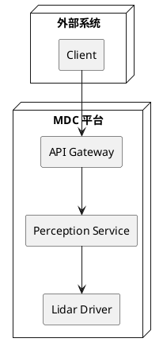

# MDC Architecture Design

架构级设计技能。当 `using-mdc-workflow` 判断需求涉及新增组件/模块/接口时，执行本技能产出两份文档：

1. **过程交付件**（arch-design-record）：架构决策记录，含 ADR、C4 视图、候选方案对比、组件定义、NFR 策略、失败模式分析
2. **项目长期资产**（component-design-doc）：组件实现设计说明书，含功能列表、代码结构、实现模型、数据设计、运行视图、接口定义、功能详设、软件单元设计、测试设计、成本评估

**为什么两份文档在同一个技能中产出？** 新增组件时，架构决策（Phase A）和组件基线设计（Phase B）是同一个认知过程：你必须先决定"这个组件是什么、为什么这样划分"（架构决策），然后才能定义"这个组件包含什么功能、怎么组织"（组件基线）。组件基线是架构决策的自然落地——没有架构决策就没有组件边界，没有组件边界就无法定义功能列表和接口。因此两份文档在同一个技能中连续产出，Phase A 的产出直接喂入 Phase B。

经 `mdc-review`(arch-design) 评审和真人确认后，组件基线确立，再进入 `mdc-ar-design` 做 AR 级增量设计。

## When to Use

适用：
- 需求规格已批准，涉及新增组件/模块/接口
- `mdc-review`(arch-design) 返回 `需修改`，需修订架构设计
- 用户请求架构级设计

不适用：仅涉及现有组件修改 → `mdc-ar-design`；规格仍是草稿 → `mdc-specify`；仅需设计评审 → `mdc-review`；阶段不清 → `using-mdc-workflow`。

## Hard Gates

- 架构设计未评审获批前，不得进入 `mdc-ar-design` 或拆解任务
- 未经 `using-mdc-workflow` 入口判断，不直接开始架构设计

## Methodology

- **ADR (Architecture Decision Records)**: 所有关键决策用 ADR 格式记录
- **C4 Model**: 架构视图按 Context → Container → Component 层次递进，绘图使用 PlantUML
- **Risk-Driven Architecture**: 先识别高风险决策，投入更多分析
- **YAGNI + Complexity Matching**: 决策由当前已确认需求驱动

## Workflow

本工作流分为两个阶段：**Phase A（架构决策）** 产出过程交付件，**Phase B（组件实现设计）** 产出项目长期资产。

---

### Phase A: 架构决策 → arch-design-record

#### 1. 确定新增组件范围

从已批准规格中提取涉及新增组件/模块/接口的需求：

- 识别哪些需求需要新架构（系统边界、新子系统、重大数据变更）
- 提取关键设计驱动因素（性能约束、可靠性要求、扩展性需求）
- 明确架构设计范围（避免过度设计）

#### 2. 分析技术上下文

了解现有架构基础：

- 现有组件和模块关系
- CMake 构建结构
- 模块依赖关系
- git-mm 仓库组织
- 现有技术栈和约束

#### 3. 提出候选架构方案

设计 2-3 个可行方案：

- 每个方案包含架构模式（微服务、分层、事件驱动等）
- 使用 ADR 格式记录决策
- 对比各方案的 trade-offs
- 解释为什么选择当前方案

**ADR 格式要求：**
- State: Proposed / Accepted / Deprecated / Superseded
- Background: 为什么需要这个决策
- Decision: 具体的架构决策
- Alternatives Considered: 考虑了哪些其他方案
- Consequences: 采用此决策的影响
- Reversibility Assessment: 可以回滚吗

#### 4. 定义新增组件

为新增的每个组件明确定义：

- 职责和边界
- 对外接口
- 数据流
- 依赖关系
- 部署要求

#### 5. 设计 C4 架构视图

使用 C4 模型生成架构视图，绘图使用 PlantUML：

- **Context View**：系统与外部交互
- **Container View**：容器/服务架构
- **Component View**：内部组件结构

#### 6. 落实非功能需求与失败模式分析

将 NFR 转化为具体架构策略：

- **性能**：缓存策略、异步处理、资源优化
- **可靠性**：冗余设计、故障恢复、监控
- **可扩展性**：配置化、插件机制、水平扩展
- **安全性**：认证授权、数据加密、审计

识别关键失败路径并制定缓解策略：

- 服务宕机：如何恢复？
- 网络分区：如何处理？
- 数据丢失：如何防止？
- 资源耗尽：如何调度？

#### 7. 编写架构决策记录

按照 `references/arch-design-record-template.md` 模板生成架构决策记录，包含：

- 修订记录
- 设计范围（新增组件识别 + 关键设计驱动因素）
- ADR 决策（架构模式选择、组件/模块划分与接口边界、其他关键决策）
- C4 架构视图（Context / Container / Component）
- 新增组件定义（职责、边界、对外接口、数据流、依赖、部署要求）
- NFR 策略
- 失败模式分析
- 技术上下文摘要

保存到 `features/<active>/arch-design-record.md`

---

### Phase B: 组件实现设计 → component-design-doc

#### 8. 组件上下文视图与全量功能列表

基于 Phase A 产出，补充组件级上下文：

- **组件上下文视图**：使用 PlantUML 组件图描述待开发组件与外围实体（底层软件、周边组件）的交互关系
- **全量功能列表**：输出该组件的全量功能点列表，功能编号命名按需定义（FUNC.001, FUNC.002, ...）

#### 9. 开发视图设计

##### 9.1 代码结构模型

使用 PlantUML 部署图展示代码结构模型（CMake/source 目录组织）：

- 模块目录结构
- 子目录划分（adapter/app/domain/infrastructure 等）
- 目录间依赖关系

##### 9.2 实现模型

通过 PlantUML 类图展示实现细节，指导开发人员进行后续代码开发：

- 核心类及其成员变量和方法
- 类间关系（聚合、组合、依赖、继承）
- 每个类的职责说明

##### 9.3 数据设计

描述组件中定义和使用的数据及数据结构：

- **简单数据**：全局变量、常量、宏
- **复合数据**：结构体、联合体等复合数据结构

##### 9.4 构建依赖

描述组件与周边组件及开源组件的构建依赖关系。

#### 10. 运行视图设计

- **交互机制**：粗粒度展示模块内各子组件或软件单元间的交互关系（PlantUML 组件图）
- **通信机制**（可选）：组件内子组件之间的通讯机制
- **数据流机制**（可选）：关键子组件的数据传递和加工
- **并发机制**：多任务、定时器、线程、协程等设计，并发保护机制（spinlock/原子操作/mutex/序列化消息等）

#### 11. 接口定义与功能详设

##### 11.1 接口定义

描述组件的对外接口，每个接口必须声明是否支持并发调用：

- **Service 接口**：接口名、描述、方法、是否支持并发、并发约束/保护机制
- **Topic 接口**（可选）：Topic 名、描述、载荷、并发约束
- **API 接口**：API 名、描述、参数、返回值、并发约束
- **软件单元间内部接口**：源/目标软件单元、接口名、描述、并发约束

##### 11.2 功能列表详设

对每个功能点进行详细设计：

- 功能描述（功能简称 + 场景列表）
- 处理流程描述（使用 PlantUML 时序图描述各场景流程，**时序图必须细化到软件单元/类的方法调用级别**，参与者用具体类名而非组件级名称，消息体现方法调用和参数）
- 本功能涉及的增量 AR 需求列表

##### 11.3 软件单元设计

描述软件单元的设计细节：

- 核心类列表（类名称、文件映射、类主要功能）
- 每个核心类的函数列表（函数类型、函数名称、函数功能）

#### 12. 测试设计与成本评估

##### 12.1 测试设计

为每个功能设计测试项：

- 测试项 ID：编号格式为 组件(子组件).功能.场景
- 期望结果
- 观测点：从边界、性能、异常结果、入参校验结果、功能结果等维度

##### 12.2 软件成本项设计评估

针对软件的内存、CPU 等进行资源消耗上限预估（ASPICE 要求）：

- CPU / MEMORY / RAM/Disk / AI Core 预估消耗变化

##### 12.3 编写组件实现设计说明书

按照 `references/component-design-doc-template.md` 模板，整合步骤 8-12 的所有产出，生成组件实现设计说明书。

保存到 `docs/<component-name>-design.md`

---

### 收尾

#### 13. 自检与派发 reviewer

**Self-Check 清单**：

Phase A 检查项：
- [ ] 不是规格复述
- [ ] 至少两个候选方案已比较
- [ ] ADR 记录完整（State/Background/Decision/Alternatives/Consequences/Reversibility）
- [ ] NFR 已落实到模块/组件
- [ ] 失败模式已分析
- [ ] C4 视图清晰（PlantUML）
- [ ] 新增组件明确定义

Phase B 检查项：
- [ ] 全量功能列表覆盖规格需求
- [ ] 代码结构模型与实际 CMake/目录一致
- [ ] 实现模型类图与接口定义一致
- [ ] 数据设计覆盖组件内部数据结构
- [ ] 运行视图覆盖交互/并发场景
- [ ] 接口定义完整且声明了并发约束
- [ ] 每个功能点有场景流程图和 AR 需求追溯
- [ ] **每个功能点的每个场景的时序图细化到软件单元/类的方法调用级别**（参与者用具体类名，消息体现方法调用，非组件级粗交互）
- [ ] 软件单元设计细化到函数级
- [ ] 测试设计覆盖功能点，观测点明确
- [ ] 成本评估已填写
- [ ] **各章节内容足以支撑后续各 AR 的实现设计**（功能列表可追溯、接口可直接引用、类图可按类拆任务、时序图可指导编码、函数级设计可直接实现）
- [ ] 无模板占位符残留

自检通过后，启动 `mdc-review(review_type=arch-design)` 进行评审（派发独立 reviewer subagent）

## MUST DO

- 用 ADR 记录所有关键架构决策
- 至少比较两个可行架构方案
- 分析关键路径失败模式并给出缓解策略
- 提供架构视图（C4 model，使用 PlantUML 绘图）
- 定义新增组件的职责、边界和对外接口
- 产出 arch-design-record（过程交付件）和 component-design-doc（项目长期资产）两份文档
- 组件实现设计说明书必须包含：功能列表、代码结构、实现模型、数据设计、运行视图、接口定义、功能详设、软件单元设计、测试设计、成本评估

## MUST NOT DO

- 为假设的未来需求过度设计（YAGNI）
- 不评估备选方案就选定架构模式
- 忽略运维复杂度和部署成本
- 只产出架构决策记录而不产出组件实现设计说明书
- 在组件实现设计说明书中遗漏接口定义或测试设计

## Output Contract

- 架构决策记录（`features/<active>/arch-design-record.md`）— 过程交付件
- 组件实现设计说明书（`docs/<component-name>-design.md`）— 项目长期资产
- `features/<active>/progress.md` 更新：`Current Stage` → `mdc-arch-design`；`Next Action Or Recommended Skill` → `mdc-review`

## 交接规则（→ mdc-ar-design）

本技能完成后进入 `mdc-ar-design`，后者须按以下规则消费本技能的产出：

1. **基线引用**：`ar-design.md` 必须引用 `docs/<component-name>-design.md` 作为组件基线，明确标注"本 AR 在组件基线上做以下增量"
2. **功能编号对齐**：`ar-design.md` 的功能点编号必须对齐 component-design-doc 的功能列表（FUNC.001, FUNC.002, ...），不可另起编号体系
3. **接口修改约束**：`ar-design.md` 对接口的修改限定为"新增/修改"，不可删除 component-design-doc 中已定义的接口
4. **架构边界**：`ar-design.md` 不可重新定义组件级架构（新增组件、改变模块划分等），那是本技能的职责。若 AR 实现中发现架构问题，应回退到本技能

## 和其他 Skill 的区别

| 易混淆 skill | 区别 |
|---|---|
| `mdc-ar-design` | 本 skill 是组件级（仅新增组件时执行），产出组件基线（arch-design-record + component-design-doc）；ar-design 是 AR 级（每轮 AR 必经），基于组件基线或现有代码做 AR 增量实现设计 |
| `mdc-review` | 本 skill 负责起草设计；review 负责评审 |
| `mdc-specify` | specify 回答"做什么"；本 skill 回答"如何做（架构层 + 组件实现层）" |
| `mdc-tasks` | 设计批准后才拆任务 |

## Reference Guide

| 文件 | 用途 |
|---|---|
| `references/arch-design-record-template.md` | 架构决策记录模板（过程交付件） |
| `references/component-design-doc-template.md` | 组件实现设计说明书模板（项目长期资产） |
| `references/adr-template.md` | ADR 格式 |
| `references/architecture-patterns.md` | 架构模式选择指南 |

## Red Flags

- 架构设计写成实现伪代码
- 只提供单一方案不讨论 trade-offs
- 新增组件未明定义职责和接口
- NFR 只在概述出现，未落实到模块
- 只产出 arch-design-record 而未产出 component-design-doc
- 组件实现设计说明书中功能列表或测试设计缺失
- 功能详设时序图仅为组件级粗交互（如"A→B: 处理"），未细化到类/软件单元的方法调用
- 接口定义未声明并发约束
- component-design-doc 功能列表或接口定义不完整，导致下游 ar-design 无法引用基线

## Verification

- [ ] 架构决策记录已保存到 `features/<active>/arch-design-record.md`
- [ ] 组件实现设计说明书已保存到 `docs/<component-name>-design.md`
- [ ] 至少两个候选方案已比较，关键决策已用 ADR 格式记录
- [ ] 组件实现设计说明书覆盖模板所有必需章节
- [ ] `features/<active>/progress.md` 已按 canonical schema 更新
- [ ] handoff 目标唯一指向 `mdc-review`(arch-design)
