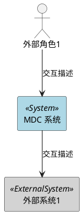
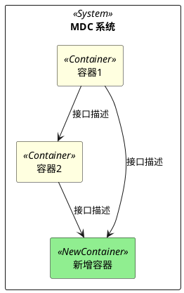
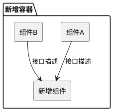

# 架构决策记录

> **简介**：记录架构级关键决策，包含候选方案对比、C4架构视图、NFR策略和失败模式分析。作为架构设计阶段的过程交付件，为下游组件实现设计提供决策依据。

---

# 1 修订记录

| 日期 | 修订版本 | 修改章节 | 修改描述 | 作者 |
| --- | --- | --- | --- | --- |
| yyyy-mm-dd | 1.00 | ALL | 初稿完成 | 作者名 + 工号 |

---

# 2 设计范围

> **AI提示**: 从已批准规格中提取本次架构设计涉及的新增组件/模块/接口范围。

## 2.1 新增组件识别

| 组件名称 | 所属子系统 | 新增原因 | 关联需求ID |
| --- | --- | --- | --- |
| | | | |

## 2.2 关键设计驱动因素

| 驱动因素 | 类型 | 约束值/描述 | 来源 |
| --- | --- | --- | --- |
| | 性能/可靠性/扩展性/安全 | | 规格ID |

---

# 3 架构决策（ADR）

> **AI提示**: 每个关键架构决策使用 ADR 格式记录。至少包含方案选择和接口划分两个决策。

## ADR-1: {架构模式选择}

### 状态

[提议 | 已接受 | 已废弃 | 被替代]

### 背景

[为什么需要这个决策？当前约束和驱动力是什么？]

### 决策

[清楚描述选择了什么架构模式]

### 被考虑的备选方案

| 方案 | 架构模式 | 优势 | 劣势 | 评估结论 |
| --- | --- | --- | --- | --- |
| 方案A | | | | 推荐/不推荐 |
| 方案B | | | | 不推荐 |
| 方案C | | | | 不推荐 |

### 后果

- 正面：
- 负面：
- 中性：

### 可逆性评估

[容易回滚 / 中等成本 / 高成本重构]

---

## ADR-2: {组件/模块划分与接口边界}

### 状态

[提议 | 已接受 | 已废弃 | 被替代]

### 背景

[为什么需要划分这些组件？划分依据是什么？]

### 决策

[清楚描述组件划分方式和接口边界]

### 被考虑的备选方案

| 方案 | 划分方式 | 优势 | 劣势 | 评估结论 |
| --- | --- | --- | --- | --- |
| 方案A | | | | 推荐/不推荐 |
| 方案B | | | | 不推荐 |

### 后果

- 正面：
- 负面：
- 中性：

### 可逆性评估

[容易回滚 / 中等成本 / 高成本重构]

---

## ADR-N: {其他关键决策}

> **AI提示**: 按需补充其他关键决策，如数据存储选型、通信机制选型、部署策略等。

---

# 4 C4 架构视图

> **AI提示**: 使用 PlantUML 绘制 C4 模型的三层视图。Context 展示系统与外部交互；Container 展示容器/服务架构；Component 展示内部组件结构。

## 4.1 Context View

> **AI提示**: 展示系统与外部角色/系统的交互关系。

---

## 4.2 Container View

> **AI提示**: 展示 MDC 系统内部的容器/服务划分及交互。

---

## 4.3 Component View

> **AI提示**: 展示新增容器内部的组件结构。

---

# 5 新增组件定义

> **AI提示**: 为每个新增组件定义职责、边界、对外接口、数据流、依赖和部署要求。这是下游 component-design 和 mdc-ar-design 的关键输入。

| 属性 | 描述 |
| --- | --- |
| 组件名称 | |
| 所属容器/子系统 | |
| 职责 | |
| 边界（负责/不负责） | 负责：... / 不负责：... |
| 对外接口（粗粒度） | 接口名、方向、简要描述 |
| 数据流 | 数据来源 → 处理 → 数据去向 |
| 依赖组件 | |
| 部署要求 | |

---

# 6 非功能需求（NFR）策略

> **AI提示**: 将规格中的 NFR 转化为具体架构策略，落实到模块/组件。

| NFR 类型 | 规格要求 | 架构策略 | 落实到的组件 |
| --- | --- | --- | --- |
| 性能 | | 缓存策略/异步处理/资源优化 | |
| 可靠性 | | 冗余设计/故障恢复/监控 | |
| 可扩展性 | | 配置化/插件机制/水平扩展 | |
| 安全性 | | 认证授权/数据加密/审计 | |

---

# 7 失败模式分析

> **AI提示**: 识别关键失败路径并制定缓解策略。

| 失败场景 | 影响范围 | 概率 | 缓解策略 | 残余风险 |
| --- | --- | --- | --- | --- |
| 服务宕机 | | 高/中/低 | | |
| 网络分区 | | 高/中/低 | | |
| 数据丢失 | | 高/中/低 | | |
| 资源耗尽 | | 高/中/低 | | |

---

# 8 技术上下文摘要

> **AI提示**: 记录分析技术上下文时发现的关键信息，作为下游设计的参考。

## 8.1 现有架构基础

- 现有组件和模块关系：
- CMake 构建结构：
- 模块依赖关系：
- git-mm 仓库组织：

## 8.2 技术约束

| 约束项 | 描述 | 影响 |
| --- | --- | --- |
| | | |
