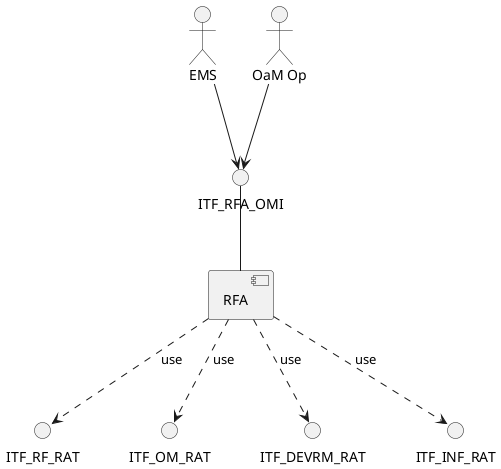
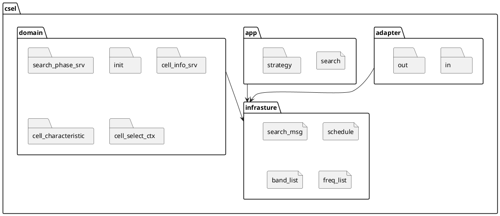
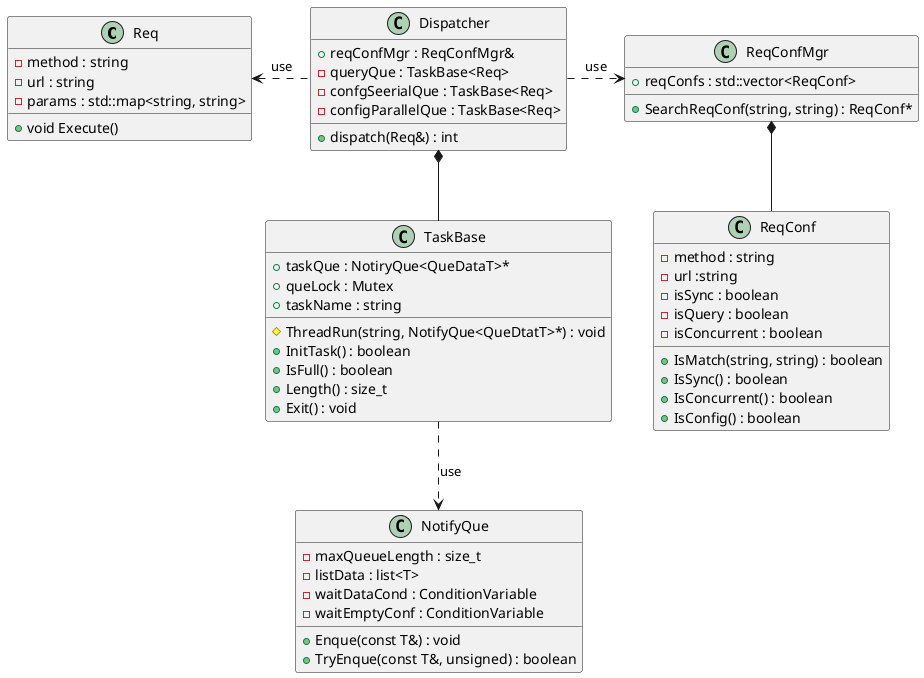
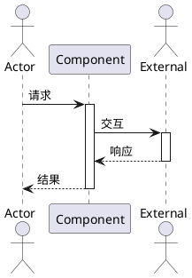

# xxx组件实现设计说明书

> **简介**：详细设计软件组件的实现算法/流程、局部数据结构，细化到软件单元定义。同时定义软件单元间的动态行(软件单元间的交互)。从互操作性、交互性、关键性、技术复杂性、风险和可测试性等对软件组件进行评估方面。详细设计的最终目标是能够直接指导后续的模块设计及编码活动。

---

# 1、修订记录

> **AI提示**: 文档版本由大版本和小版本组成，大小版本中间用"."分隔。大版本号用数字标识，按1-9依次顺序递增。过程修订的小版本用数字标识，从00-99依次顺序递增。

| 日期 | 修订版本 | 修改章节 | 修改描述 | 作者 |
| -------- | ------------- | ----- | -----| -----|
| 2020-03-02 | 1.00  | ALL | 初稿完成 | 作者名 + 工号 |
| yyyy-mm-dd | 1.01  | xxx | 修改xxxx | 作者名 + 工号 |

---

# 2、术语

> **AI提示**: 定义组件相关的专业术语。

| 缩略语 | 英文全名 | 中文解释 |
| --- | ----| ----|
| 软件组件 | Software Component | 软件系统架构设计的最低层架构元素，开展详细设计的对象。ADS域内应是独立功能的实体单元。如License、Camera_SA。 |
| 软件单元 | Software Unit | 软件详细设计的产物，是组件的最小单独可执行和可测试的实体 |
| 软件功能 | Software Function | 软件功能可以是对单个或一组相似功能的抽象。如License管理作为软件功能，包含了License创建、删除、更新等子功能。在定义软件功能时，不要把不相关功能放在一个软件功能中。 |

---

# 3、概述

## 3.1、目的

> **AI提示**: 描述组件设计的目的。

详细设计软件组件的实现算法/流程、局部数据结构，细化到软件单元定义。同时定义软件单元间的动态行(软件单元间的交互)。从互操作性、交互性、关键性、技术复杂性、风险和可测试性等对软件组件进行评估方面。详细设计的最终目标是能够直接指导后续的模块设计及编码活动。

---

## 3.2、简介

| 组件名称 | 命名（软件模块/组件/ CBB/服务等）|
| -------- | ------------------------------- |
| 所属软件系统/子系统名称 | 一般对应SE软件架构设计中的子系统 |
| 组件职责 | 组件功能总体描述 |
| ASIL等级 | QM/ASILA、B、C、D，来自软件架构设计定义 |

---

## 3.3 参考资料

> **AI提示**: 列出本文档引用的所有标准、文档及其版本号。

| No. | Type | Associated Materials |
| --- | ----| ----|
| 1 | 规范文档 | 《ADS软件详细设计规范》 |
| 2 | 产品文档 | 《XX软件架构设计说明书》 |
| 3 | 产品文档 | 《XX软件接口说明书》 |
| 4 | 产品文档 | 《XX软件需求说明书》 |

---

# 4、输入

> **AI提示**: 本章节内容继承自架构设计说明书和需求说明书

## 4.1 组件上下文视图

> **AI提示**: 本节描述待开发软件组件与外围实体（底层软件，周边组件）的关系，这些外围实体与本组件发生交互作用或以某种方式影响本组件。建议使用plantuml组件图来描述。

---

## 4.2 组件全量功能列表

> **AI提示**: 输出该功能组件的全量功能点列表；功能编号命名按需定义。

| 功能编号 | 功能描述 | 纳入版本 |
| --- | ----| ----|
| FUNC.001 |  |  |
| FUNC.002 |  |  |
| FUNC.003 |  |  |

---

# 5、组件详细设计

## 5.1 软件1层实现设计

### 5.1.1 开发视图

#### 5.1.1.1 代码结构模型

> **AI提示**: 建议使用plantuml部署图完成代码结构模型展示

---

#### 5.1.1.2 领域模型（可选）

> **AI提示**: 如有领域模型，在此描述

略

---

#### 5.1.1.3 实现模型

> **AI提示**: 通过类图展示实现细节指导开发人员进行后续代码开发。

**说明**：
- Req类，这里以Restful格式请求为例，主要包含了method和url成员；Req被分发器分发到队列中，然后经过调度线程取出后执行Req的处理函数Execute来处理。
- Dispatcher类，其依赖请求的配置信息，根据配置信息，选择将请求加入到不同的请求队列中。
- ReqConfMgr类，用于管理各种不同请求的配置信息，聚合了许多ReqConf实例。
- ReqConf类，对应到单个请求的配置信息，进程初始化时从配置文件中加载到内存中进行实例化。
- NotifyQue类，实现了一个通知队列。将数据加入队列时，会判断是否队列满，如果队列满会等待队列中有空闲后再加入；从队列中取数据时，会检查队列是否有数据，如果没有也可能会等待有数据后再取出。
- TaskBase类，将队列和线程池组合到一起。在初始化时，会创建线程池；线程池会不断检查队列中是否有数据加入，如果有则取出数据进行处理。

---

#### 5.1.1.4 数据设计

> **AI提示**: 描述组件中定义和使用的数据及数据结构，包括：简单数据，如组件级的全局变量、常量、宏；复合数据，如组件内部的结构、联合。

##### 5.1.1.4.1 简单数据描述

> **AI提示**: 列出全局变量、常量、宏等简单数据

| 名称 | 类型 | 描述 |
| --- | --- | --- |
| | | |

---

##### 5.1.1.4.2 复合数据描述

> **AI提示**: 列出结构、联合等复合数据

| 名称 | 类型 | 成员 | 描述 |
| --- | --- | --- | --- |
| | | | |

---

#### 5.1.1.5 构建依赖

> **AI提示**: 描述SWC和周边组件及开源组件的构建依赖关系。

| 组件名称 | 依赖库 | 依赖库归属 |
| --- | --- | --- |
| AppControl | Framework.so | 中间件 |
| AppControl | someip.so | 海思 |
| AppControl | Libmqtt.so | 开源 |

---

### 5.1.2 运行视图

#### 5.1.2.1 交互机制

> **AI提示**: 粗粒度展示模块内各子组件或软件单元间的交互关系。详细的功能交互在AR实现设计章节中体现。建议使用组件图。

---

#### 5.1.2.2 通信机制（可选）

> **AI提示**: 描述组件模块内子组件之间的通讯机制。

---

#### 5.1.2.3 数据流机制（可选）

> **AI提示**: 从组件模块内关键子组件的数据传递和加工角度，表达系统的逻辑功能。

---

#### 5.1.2.4 并发机制

> **AI提示**: 描述组件如果涉及多任务、定时器、线程、协程等设计，组件内部如何应对并发的场景的涉及细节。

- 明确组件并发的场景约束：组件是否涉及并发或并发能力（多核/单核/多系统/单系统等），如不支持并发需要明示。
- 如涉及并发，则明确组件内涉及并发部分采用何种机制进行并发保护：如spinlock/原子操作/开关中断/mutex/序列化消息等等。
- 其他：这里包括在系统设计层面不可见的公共机制、编程语言或并发库等提供的线程/协程支持等 **注意** 这里需要明确保证并发开销可控，否则需在系统设计层面体现。

---

## 5.2 数据库（可选）

> **AI提示**: 如有数据库设计，在此章节描述。

### 5.2.1 实体、属性及它们之间的关系

| 实体名 | 属性 | 描述 |
| --- | --- | --- |
| | | |

### 5.2.2 实体关系图

> **AI提示**: 使用ER图描述实体间关系

不涉及

---

## 5.3 UI设计（可选，前台服务涉及）

> **AI提示**: 本章节描述本系统的关键用户交互设计，界面原型，操作流等。

不涉及

---

# 6 组件或子组件关键功能设计

## 6.1 接口定义

> **AI提示**: 描述组件的对外接口。每个接口必须声明是否支持并发调用；不支持并发的接口需明确调用约束（如"仅允许单线程调用""需持有xxx锁"等），支持并发的接口需说明并发保护机制。

### 6.1.1 对外Service接口

| 接口名 | 描述 | 方法 | 是否支持并发 | 并发约束/保护机制 |
| --- | --- | --- | --- | --- |
| | | | 是/否 | |

### 6.1.2 对外Topic接口（可选）

| Topic名 | 描述 | 载荷 | 是否支持并发 | 并发约束/保护机制 |
| --- | --- | --- | --- | --- |
| | | | 是/否 | |

### 6.1.3 对外Api接口

| API名 | 描述 | 参数 | 返回值 | 是否支持并发 | 并发约束/保护机制 |
| --- | --- | --- | --- | --- | --- |
| | | | | 是/否 | |

### 6.1.4 软件单元间内部接口

| 源软件单元 | 目标软件单元 | 接口名 | 描述 | 是否支持并发 | 并发约束/保护机制 |
| --- | --- | --- | --- | --- | --- |
| | | | | 是/否 | |

---

## 6.2 功能列表详设

> **AI提示**: 详细设计每个功能点。

### 6.2.1 FUNC.XXX功能设计

#### 6.2.1.1 功能描述

功能简称:

> **AI提示**: 功能简称用于和类图以及测试设计中的用例ID关联

功能描述：

> **AI提示**: 功能简要文字描述，可以从使用场景、约束、能力等方面描述

**场景列表**:

| 场景分类 | 英文描述 | 场景描述 |
| -------- | ----------- | -------- |
| | | |

---

#### 6.2.1.2 处理流程描述

> **AI提示**: 描述到软件单元间的流程处理

##### 6.2.1.2.1 xx场景流程描述

> **AI提示**: 使用时序图描述详细流程。时序图必须细化到软件单元/类的方法调用级别：参与者用具体类名（如 `TrackManager`、`DataProcessor`），消息体现方法调用（如 `processData(rawFrame)`），而非组件级粗交互（如 "A→B: 处理"）。每个场景必须有时序图，后续各 AR 的实现设计将直接基于此时序图编写代码。

---

#### 6.2.1.3 本功能设计的增量AR需求列表

> **AI提示**: 列出本功能涉及的AR需求

| AR编号      | AR描述   | 兼容性影响                 | AR实现设计文档地址 |
| --------- | ------ | --------------------- | ---------- |
| Xxx_AR001 | xxAR标题 | 从升级、回退、功能变更等维度考虑兼容性影响 |            |

---

## 6.3 软件单元设计

> **AI提示**: 描述软件单元的设计细节。

### 6.3.1 <Xxx软件单元>

#### 6.3.1.1 核心类列表

| 序号 | 类名称             | 文件映射 | 类主要功能 |
| ---- | ------------------ | ----------- | -------|
| 1    | ExampleTrack | example_track.h  | 完成x传感器的目标生成和跟踪处理 |
| 2    | ExampleMgr   | example_mgr.h  | 完成对ExampleTrack管理 |

---

#### 6.3.1.2 ExampleTrack类描述

| 序号 | 函数类型 | 函数名称 | 函数功能 |
| ---- | -------- | ----------- | -------|
| 1    | 外部接口 | void xxxx()  | 构造函数，实现XX功能 |
| 2    | 内部接口 | bool yyyy(int)  | 析构函数，实现XX功能 |

---

#### 6.3.1.3 ExampleMgr类描述

| 序号 | 函数类型 | 函数名称 | 函数功能 |
| ---- | -------- | ----------- | -------|
| 1    | 外部接口 | void xxxx()  | 构造函数，实现XX功能 |
| 2    | 内部接口 | bool yyyy(int)  | 析构函数，实现XX功能 |

---

## 6.4 需求描述列表

### 6.4.1 Xxx_AR001需求详述

##### 需求背景：

##### 需求描述：

##### 关键流程：

### 6.34.2 Xxx_AR002需求详述

##### 需求背景：

##### 需求描述：

##### 关键流程：

---

## 6.5 测试设计

> **AI提示**: 
> 测试项ID：编号格式为 组件(子组件).功能.场景
> 功能描述：描述用例覆盖的主要功能及场景。
> 测试观察点：从边界、性能、异常结果(流程异常)、入参校验结果、功能结果等维度给出用例需要检查的关键点。

#### 6.5.1 xxx功能测试

测试项ID: license.LicMgr.CreateLicense.FetchToken
期望结果: 与云端建立通道并获取交互Token
观测点:
1、功能可用。
2、需测试函数执行时间小于1s。
3、支持重试3次。

#### 6.5.2 xxx功能测试

测试项ID: license.LicMgr.CreateLicense.DownLoadLicenseFile
期望结果: 从云端下载License文件
观测点:
1、功能可用。
2、License文件正常保存。
3、创建的License文件合法

---

# 7 详细设计方案评审纪要

> **AI提示**: 记录评审会议纪要

---

# 8 软件成本项设计评估（ASPICE要求）

> **AI提示**: 针对软件的内存、CPU等进行资源消耗上限预估。本章节重点是反向检查详设过程中的资源消耗是否和软件架构设计分析一致。

| 编号 | 软件成本项 | 预估消耗变化（上限预估） | 说明   |
| ---- | ---------- | ----------------------- | -------|
| 1    | CPU        | | |
| 2    | MEMORY     | | |
| 3    | RAM/Disk   | | |
| 4    | AI Core    | | |

---